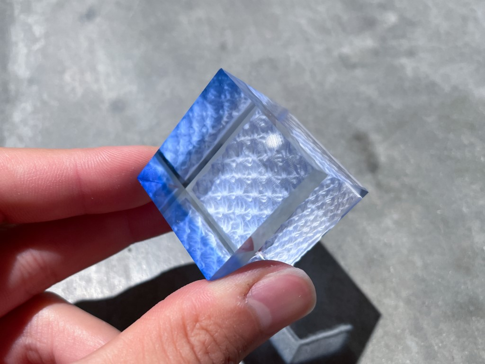
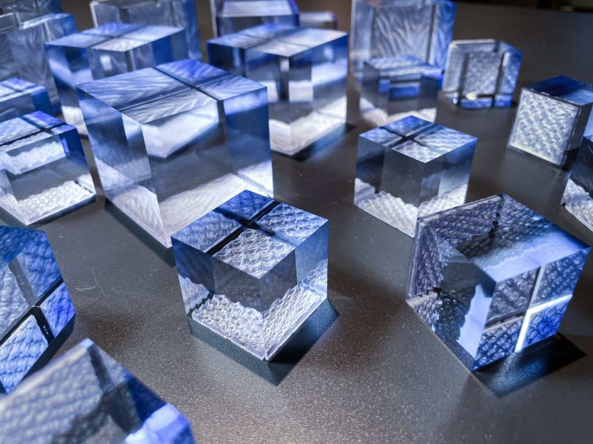
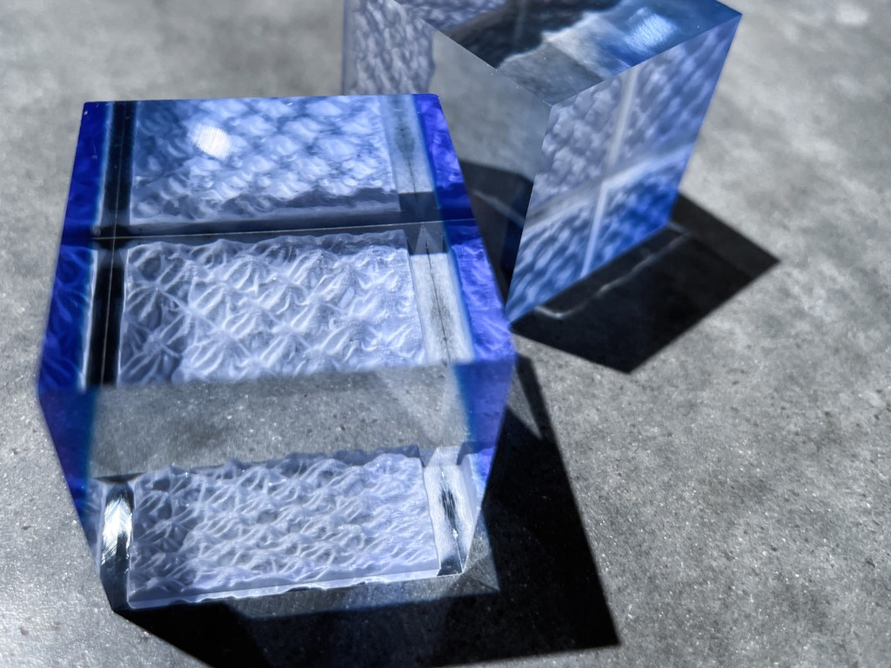
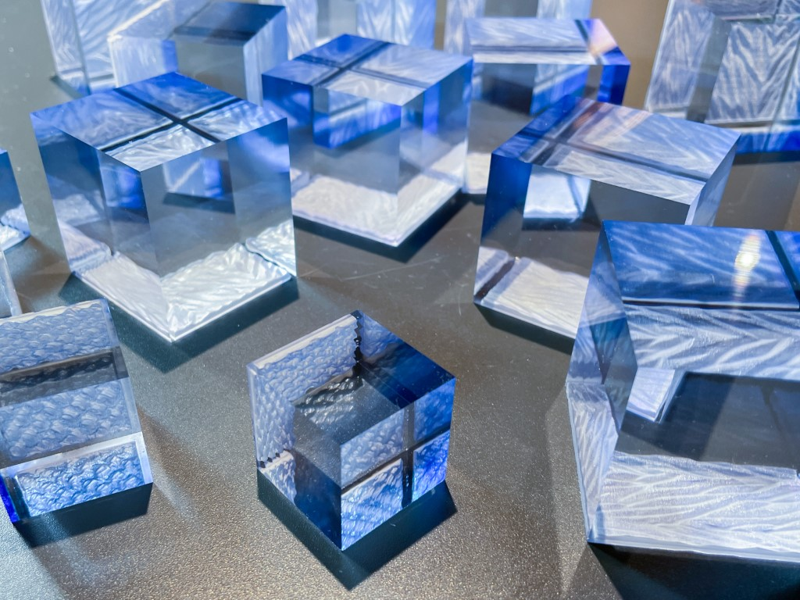

 

伝統工芸「有松・鳴海絞り」の絞り過程で生じる凹凸を3Dスキャンし，様々な素材に転写することで新たなテクスチャの表現に取り組む，[有松の転写プロジェクト](../arimatsu)の新たな作品として，アクリルブロックに加工を施しました． 
凹凸にあわせレーザーの出力を変えるデータをつくり，アクリルを彫り込みます．

大きいアクリルにはラインの美しい杢目絞りを，

小さいアクリルには繊細な凹凸が美しい蜘蛛絞りを，

アクリルの染色と組み合わせることで，グラデーションと転写のテクスチャの織りなす美しい世界が広がります．

見る角度により，様々表情を変える不思議なペーパーウエイトです．

`youtube:https://www.youtube.com/embed/ALDWXlwgkRs`

クライアント：株式会社matomato 一級建築士事務所

Date : 2022.09  
Category : Product