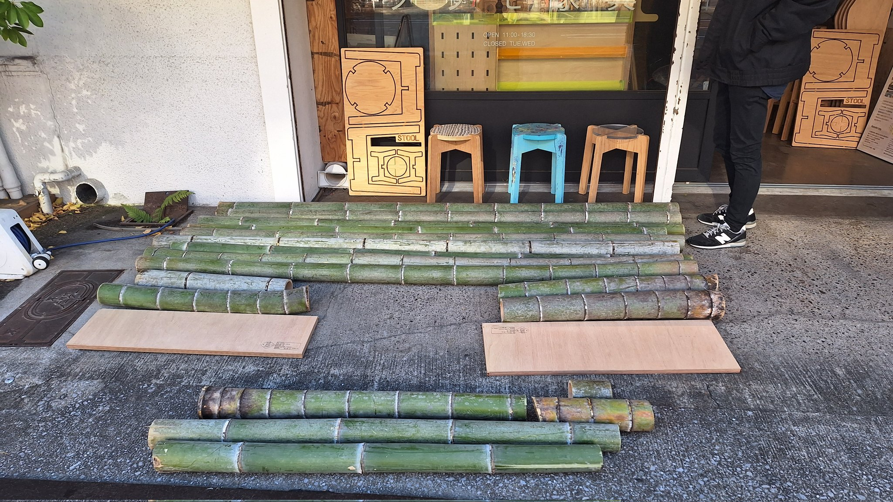
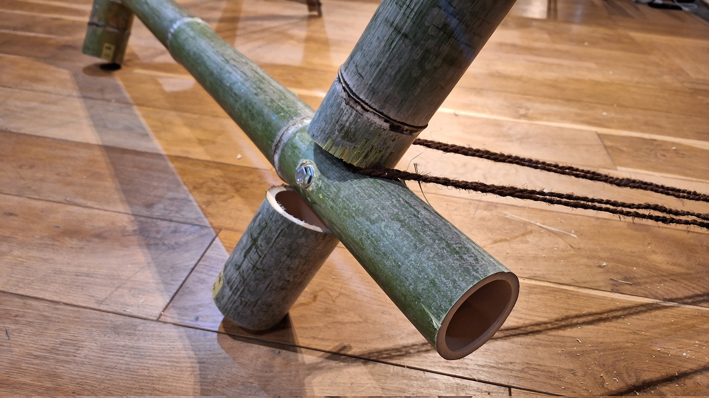
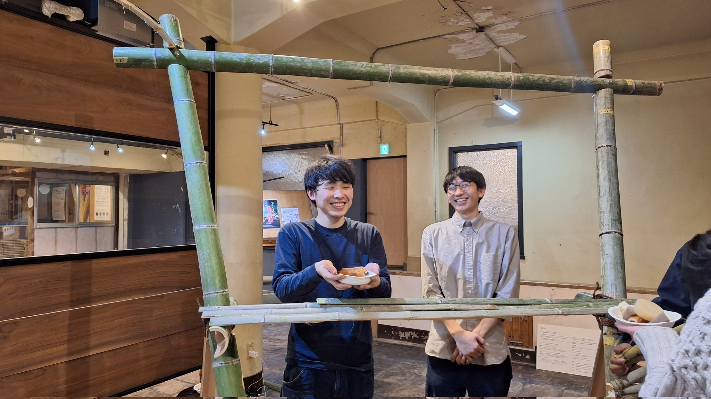
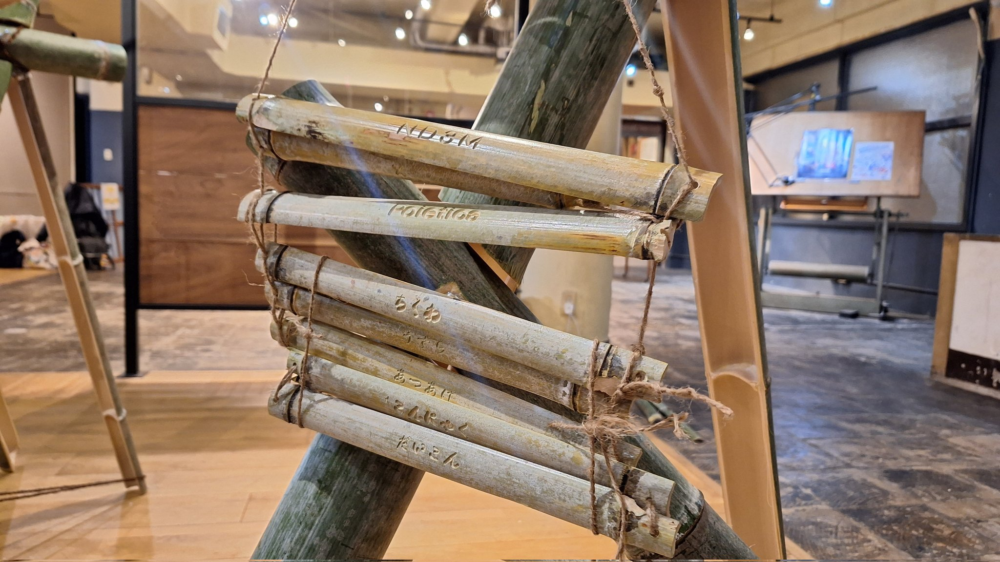

 

CNCによる切削加工といえば木材が中心であるが、今回は竹に着目した。
竹材料といえば、放置林や廃棄問題が昨今話題となっている材料であり、竹材料の新たな加工の仕方を模索することで、竹の活用を促す。

屋台のデザインにあたって、接合部のCNC掘削加工を研究した。

屋台を制作しおでんを振る舞うワークショップを開催した。

協業 
株式会社Poietica 
CNC加工協力　プラモ家具 

Date：2023.12 
Category：Workshop 

