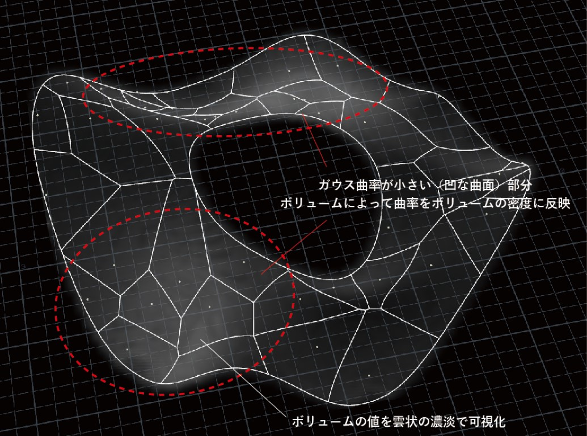
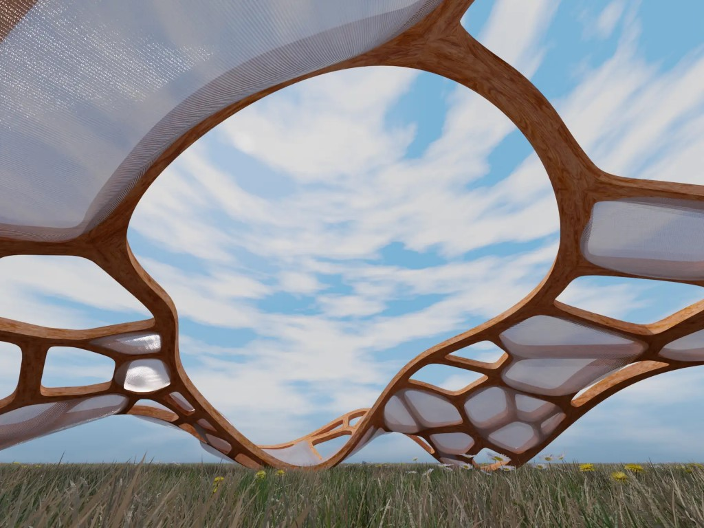
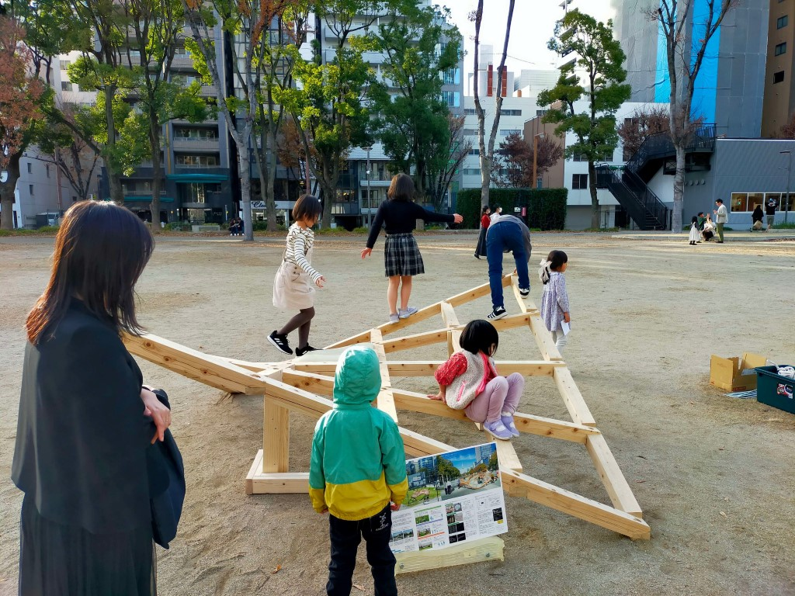
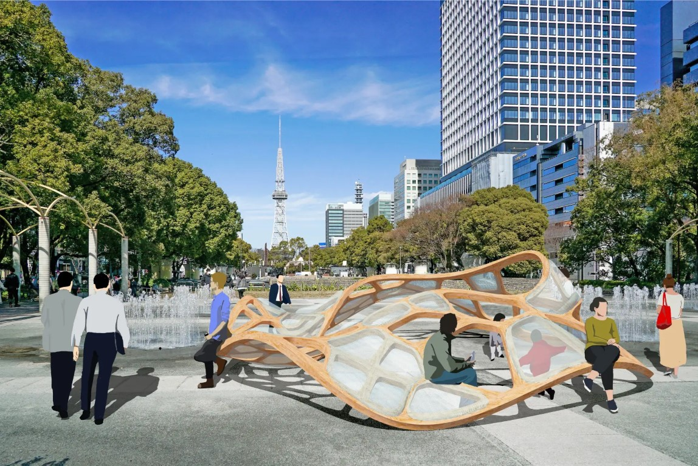

 

歩いて楽しい街、滞在して楽しい憩いの場を、モノづくりを通して提供するプロジェクト。

「ゆりかご」や「帽子」をモチーフにした柔らかい曲面を木材を使って実現することで、優しく包み込む空間を創出する。

木フレームのジオメトリーデザインは、Grasshopper と Houdini を連携してプログラムを作成し、デザイナー達がより感覚的に面白い形状をスタディしつつも、接合部数や部材数の最適化を両立できる設計フローを開発した。

詳細
建築学会情報シンポジウム 2023
「多軸 CNC を用いた木材加工のためのプロシージャルな曲面生成と部材配置検討」
(田川直樹・田住梓・池本祥子・鷲見良・河野哲也)

[ND3M 作品集 2022-2023. P.9-10 に掲載](https://drive.google.com/file/d/1dHDl-V2yBJ08tXo1aBE7TyvMGvnA3MaH/view?usp=drivesdk)

座面は 3D プリンターで制作し、つるつるとした肌触りで太陽の光に当たるとキラキラと光る樹脂素材で、思わず触りたくなるカタチを目指す。

2023 年 12 月にはモックアップを久屋大通公園に設置し、たくさんの子供達に遊んでもらった。

現在は基本設計・詳細設計が終わった段階であり、2025 年度竣工を目指して動いている。

協業：株式会社アーティストリー 
Date : 2020.03 ～ 現在 
Category :Pavilion
