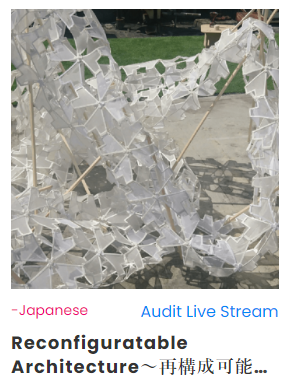

 

6月に開催された，オンラインベースの国際ワークショップ，DigitalFUTURES 2022 にて，
ND3MのR&Eコミュニティで日本語ワークショップを行いました． 
本年より日本語でのワークショップが始まるとのことで，Grasshopper初心者を対象に，ハンズオンとその後の作品制作からなるプログラムで構成しました． 

__Reconfigurable Architecture ～再構成可能な建築を考える～__ 
と題し，セル・オートマトン，平面充填，折り紙，モジュールなどの観点から，理論と，GHのハンズオンを行いました．

[DigitalFUTURES公式ページはこちら](https://digitalfutures.international/workshop/reconfiguratable-architecture%EF%BD%9E%E5%86%8D%E6%A7%8B%E6%88%90%E5%8F%AF%E8%83%BD%E3%81%AA%E5%BB%BA%E7%AF%89%E3%82%92%E8%80%83%E3%81%88%E3%82%8B%EF%BD%9E/)

`youtube:https://www.youtube.com/embed/videoseries?list=PLDiPM_qRsG-L6ZUkqef0MBs3zLzETd0Zs`

 
Date:2022.06.27 
Category:Workshop
