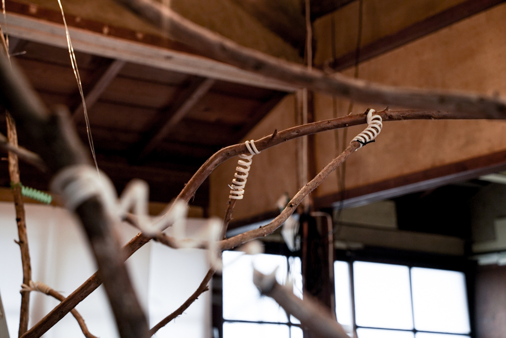
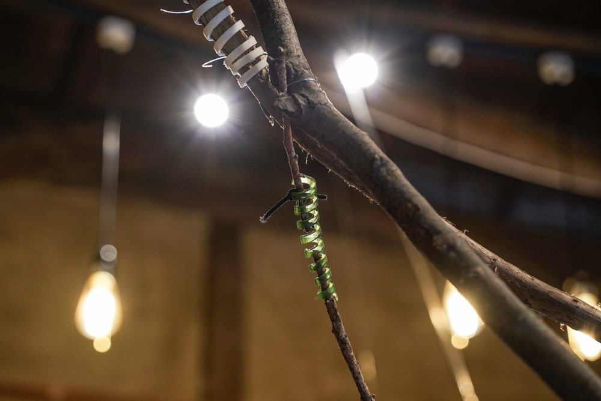
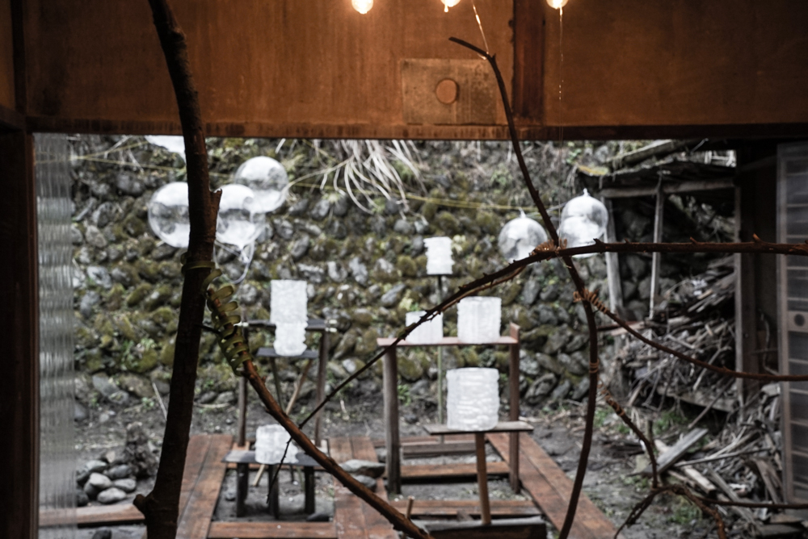
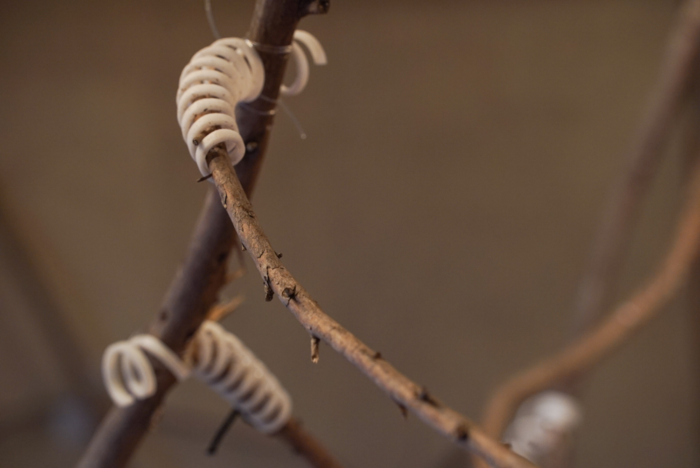
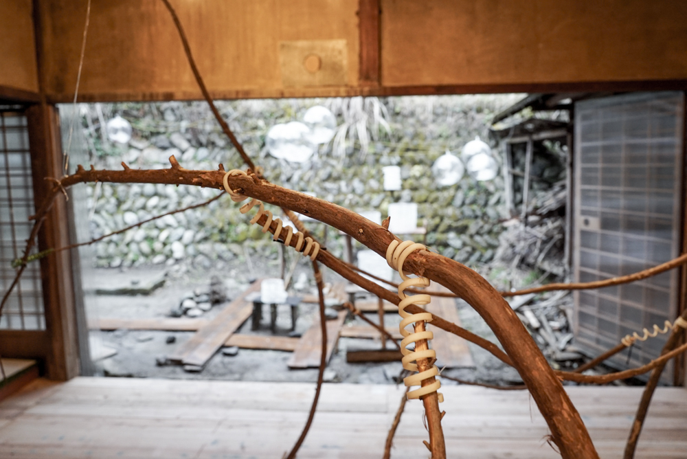
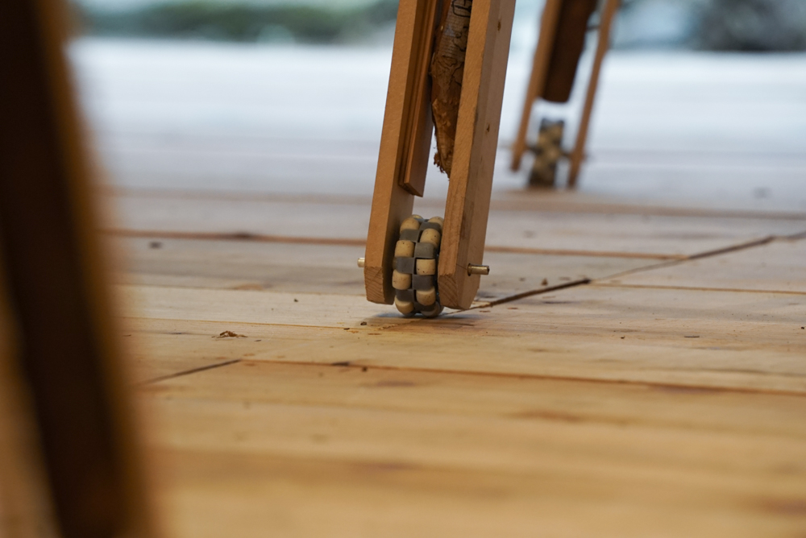
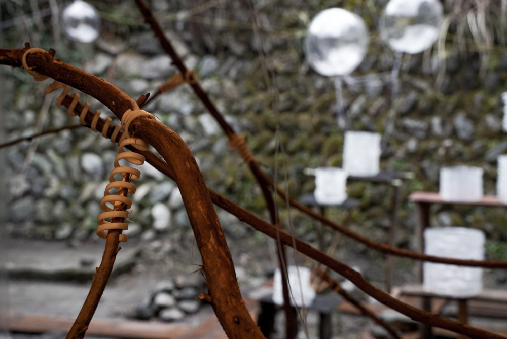
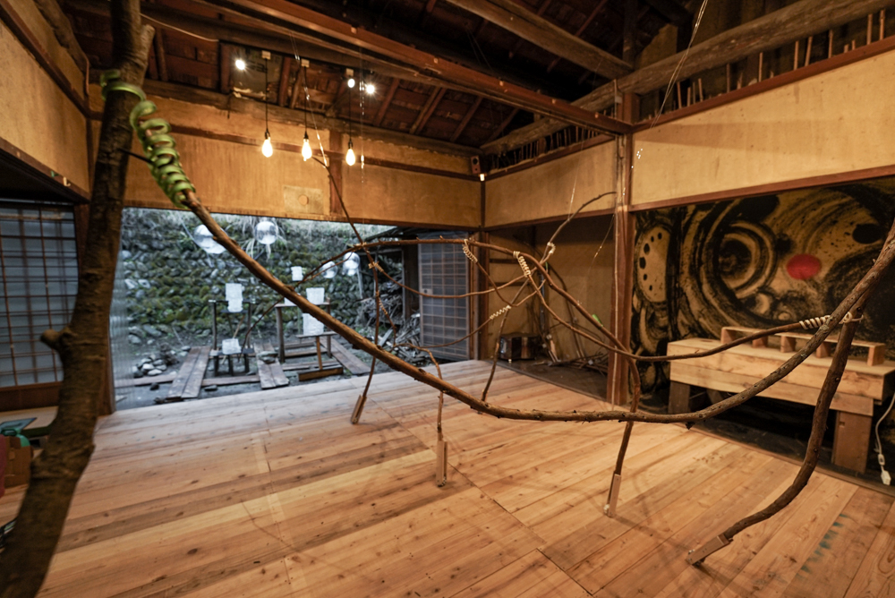
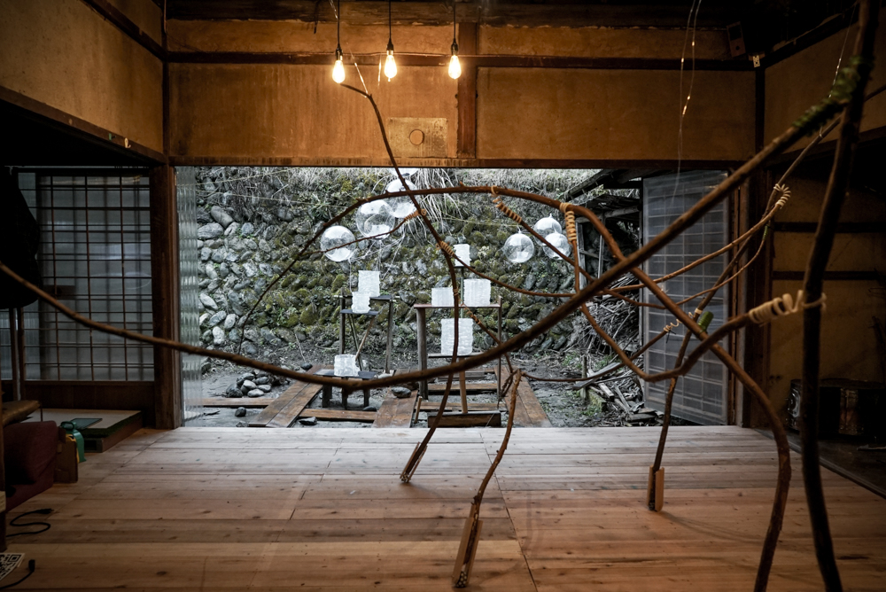

 

[WILD FAb FESTIVAL](../WildFab)の展示として，吉野の自然を室内で感じることのできる装置を制作しました．

山にいると，風に揺れた枝が擦れ合い，隣の木の枝にも影響し，森が一つになっていることを実感します． 
吉野の山から採取した枝を，バネ状のジョイントを介し繋ぐことで，一つの枝の揺れが他の枝へと伝播し，風に揺られうねる森の気配を感じられるようにしました．また，それぞれの枝は車輪を介して接地しており，揺れるだけでなく動きながら，全体でバランスを取って成立しています．

`youtube:https://www.youtube.com/embed/LOIRz8O18pA`

Date : 2022.03.19 
Category : installation