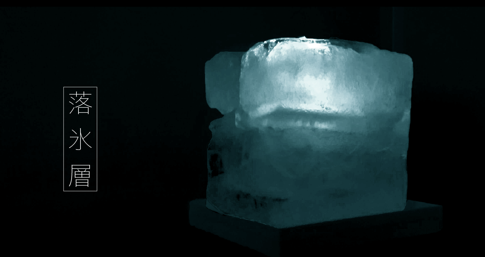
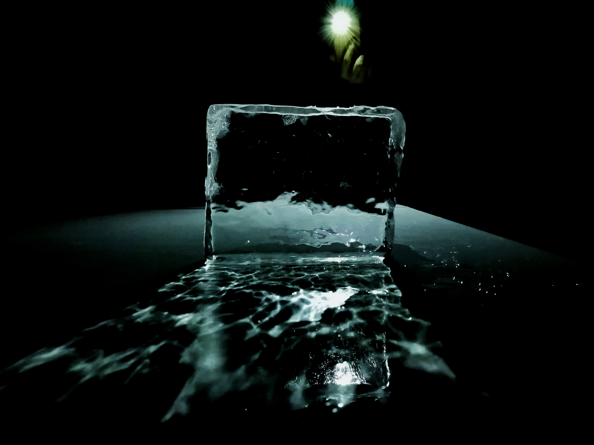
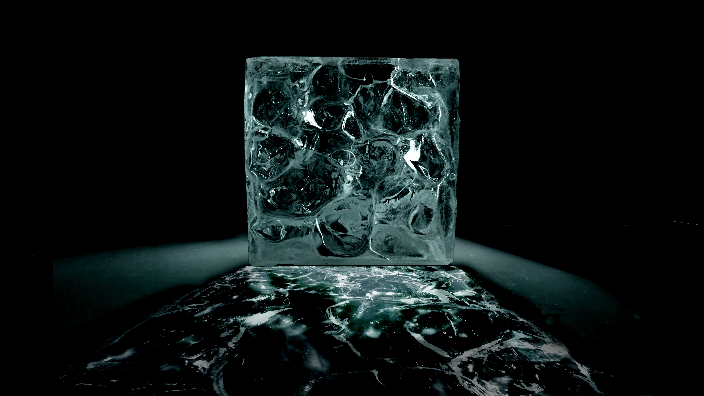
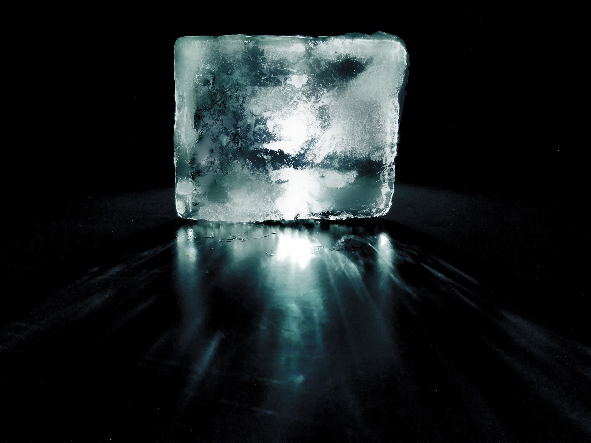
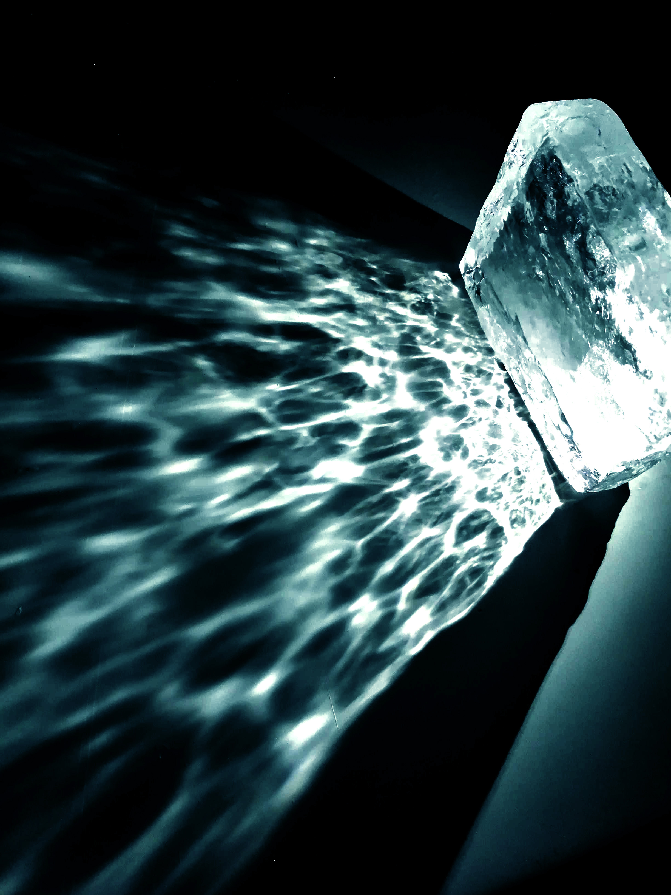

## 落氷層 -Rakuhyousou-

学生照明展 2020 出展作品

落氷層は4種類の氷の層が重なってできた1つの氷塊である，この氷塊の中には小さな光源が入っており，光源の重さと生じる熱により徐々に解けて氷塊の中を貫通して落ちていく．4種類の層の氷それぞれがもつ特徴に応じた光の屈折や反射により，光源の位置が移動していくのに伴い，，ゆっくりと時間をかけて変化していく，さらに氷塊自体が解けていくことで全体的なシェイプが変化していき，そして解けてなくなり最後には小さな光源だけが残される24時間365日という決められた時間に縛られがちな私たちの生活の中で，あえて「予測ができない」「いつ消えるかわからない」光を提案することで，時間に縛られない，変化する不規則で不完全な照明を提案する，

  

Date : 2020.03  
Category : Product, Competition
