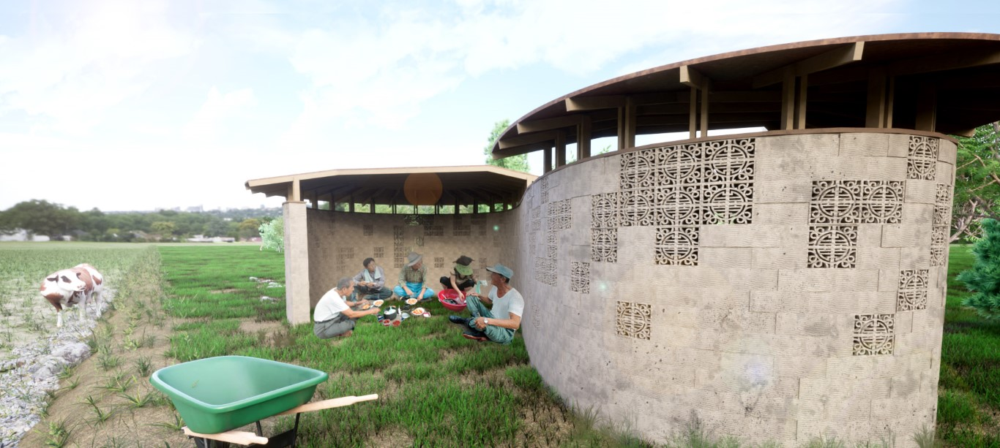
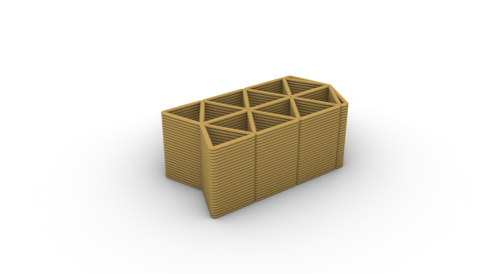
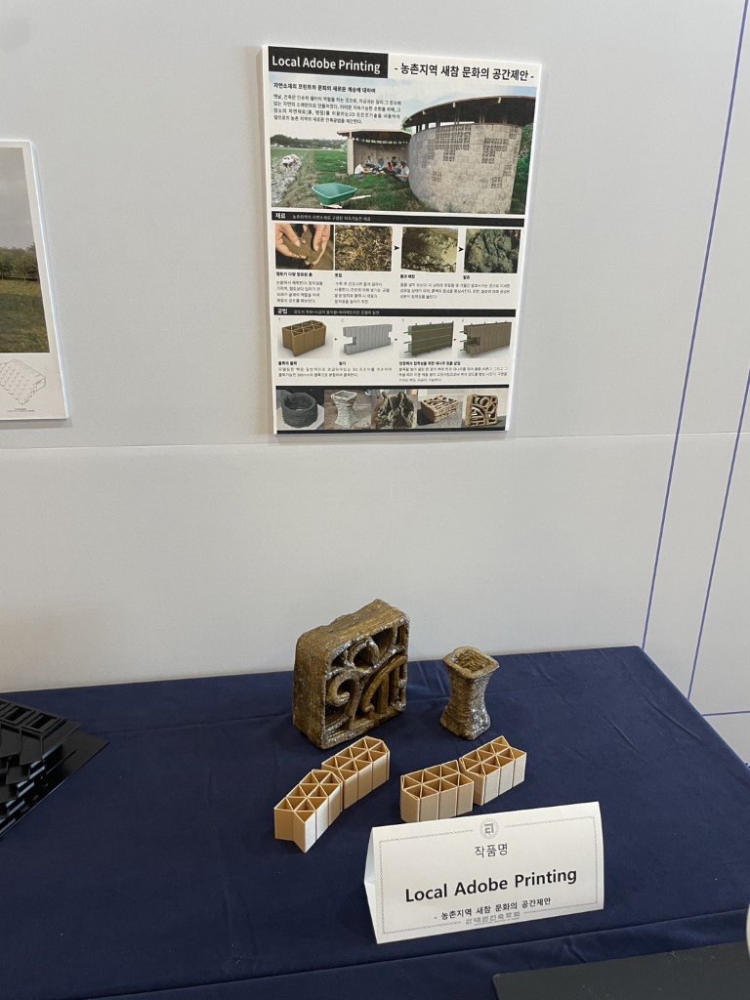

大韓建築学会主催，[3Dプリント競技大会](https://www.aik.or.kr/html/page05_01.jsp?ncode=a001&num=2441)にて，土壁の3Dプリンティングに関する提案を行いました．

韓国の農村の伝統である，農作業の中での交流文化のための場を，田畑の土を用いてプリンティングすることにより形成します．
現地の素材で，大型のプリンタを必要としないユニットに分割する計画とすることで，小屋の構築から人々が主体的に関わり，文化を醸成していくことを目指します．

`youtube:https://www.youtube.com/embed/3vy3YzfCvOg`

Date:2022.10.26 
Category:Competition, 3Dprint