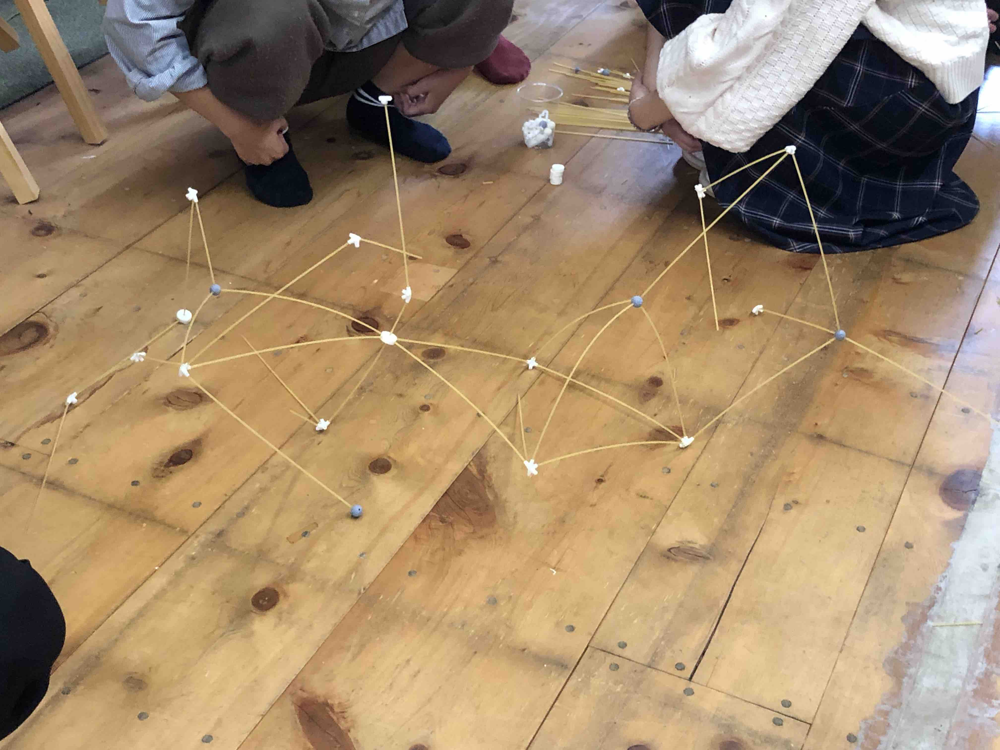

### EnjointingSpaghetoini

2020 年 9 月 16 日

EMARF 学生アンバサダーに関連して行ったリサーチ企画。
オンラインで参加者を募り、他のアンバサダーを始め計 1 ０名が集まり、2 つの観点から分析を行った。9/16 に行われたプレゼンテーションでは、VUILD の秋吉氏をお招きし、公開ディスカッションを行った。

開催当日は、WS の参加学生 15 人と講評に 4 名の建築家や先生、加えて 3 人の見学者で白熱しました。

WS の後は参加者の自己紹介もかねて自分が今までかかわってきたプロジェクトや論文、設計のプレゼンを行いました

`youtube:https://www.youtube.com/embed/BCpumtefko4`
