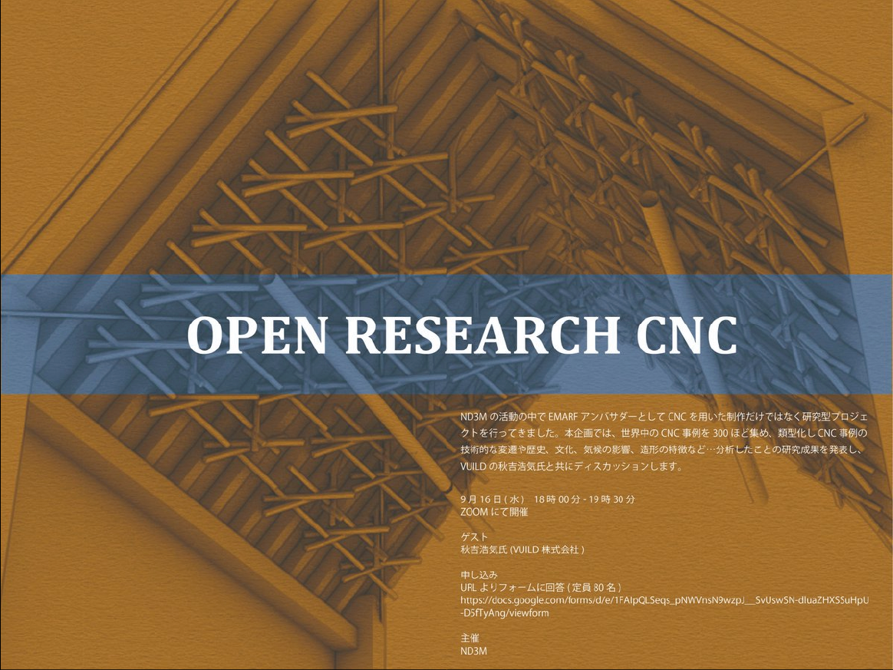

 

EMARF 学生アンバサダーに関連して行ったリサーチ企画。  
オンラインで参加者を募り、他のアンバサダーを始め計 1 ０名が集まり、2 つの観点から分析を行った。9/16 に行われたプレゼンテーションでは、VUILD の秋吉氏をお招きし、公開ディスカッションを行った。

 

第０回　 7/15・22 　プレミーティング  
第１回　 8/ 5 　事例を集める  
第２回　 8/12 　タイトルと目次を考える  
第３回　 8/19 　集めた事例を分類する  
第４回　 8/26 　分類した事例を分析する  
第５回　 9/ 2 　全体像の把握と解釈を考える  
最終回　 9/16 　成果報告会

[リサーチ閲覧はこちら(google drive)](https://drive.google.com/file/d/1upOFu6WNlZ1gEbbcCD2Fb1P210qWN8C2/view?usp=sharing)

　 

Date : 2020 年 9 月 16 日  
Category : Research
