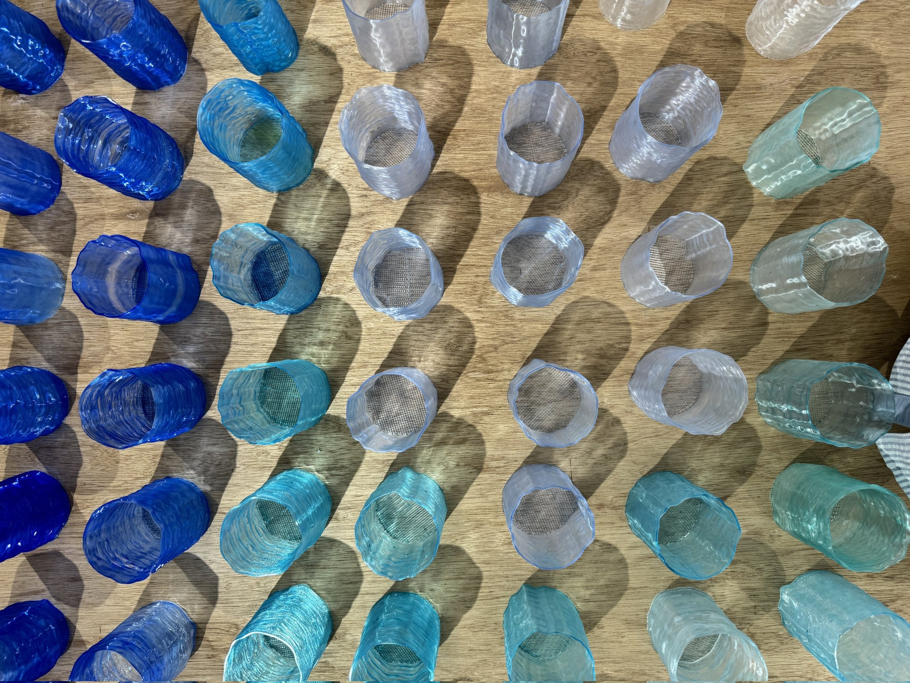
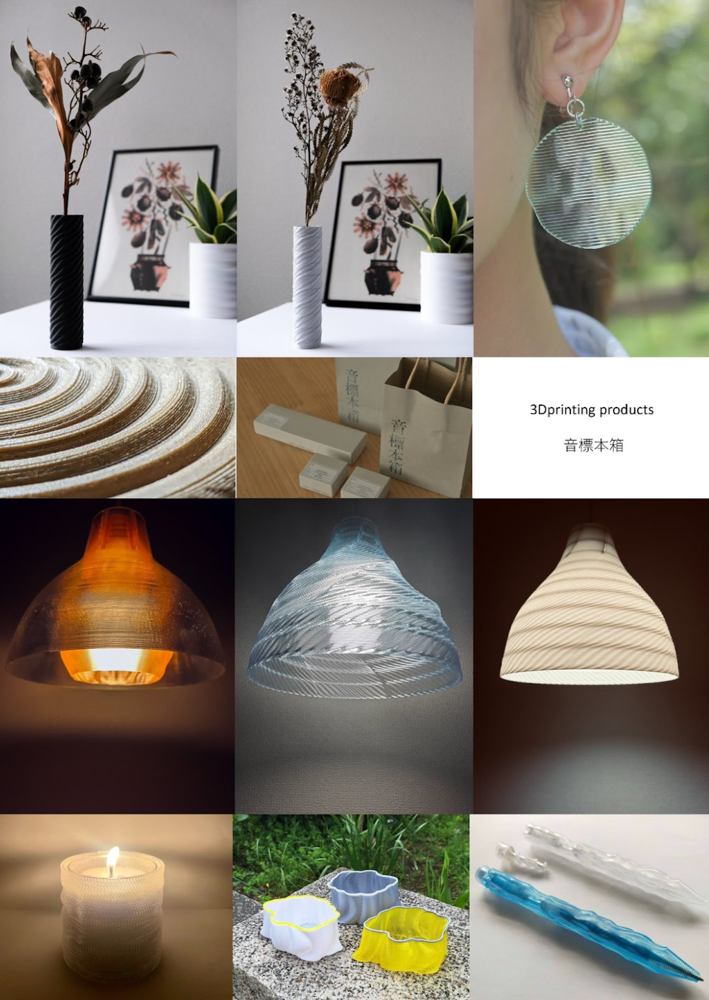
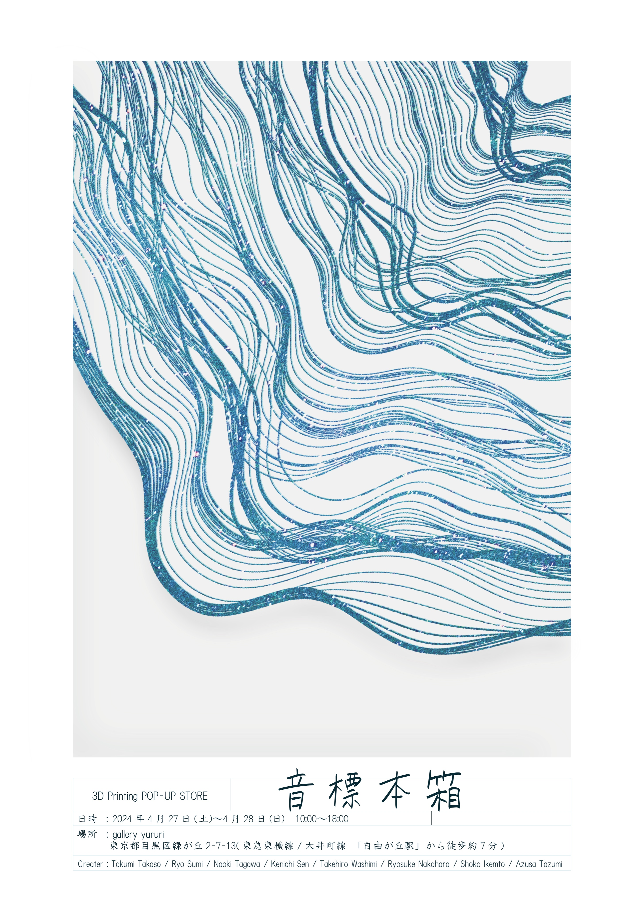
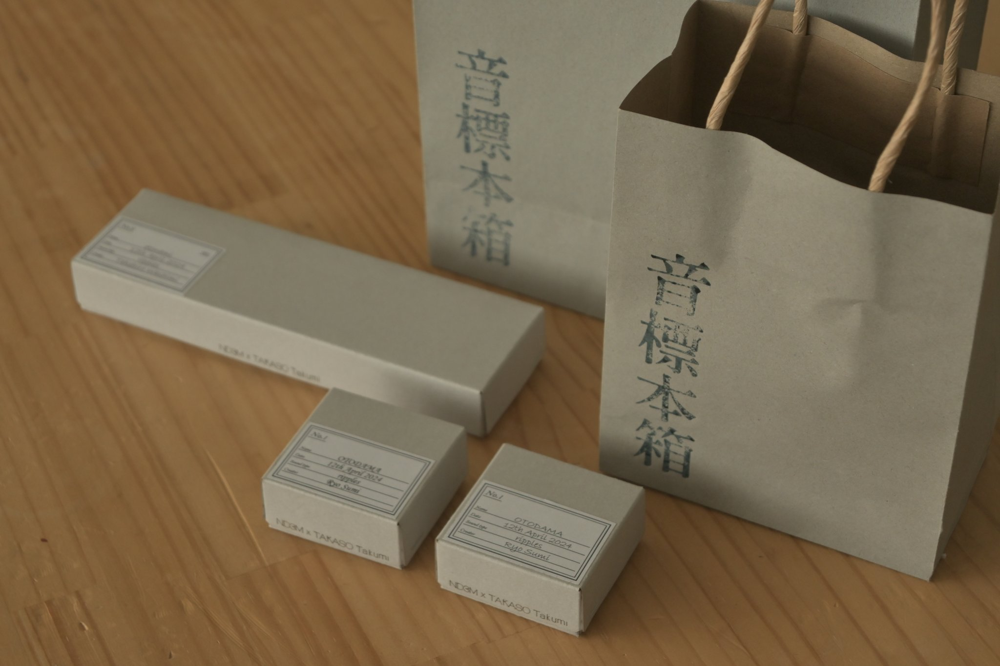

 

音を採取しパラメトリックにモデルを生成、3D プリントしてマテリアライズする取り組みである「音標本」プロジェクト。
2 年前からプロトタイプ、展示、ワークショップを行ってきた中で今回はプロダクト開発を行い POP UP STORE を開催した。

8 名のクリエイターと共に、東京都内にあるギャラリー「yururi」にて開催した。
クリエイター達は自ら音を採取し、それぞれの想いを元にカタチにした。
販売したプロダクトのラインナップは、ランプシェード・イヤリング・ピアス・コースター・花瓶・小物ケース・ペンなど、日常で使えるものが中心である。

フライヤーデザイン、パッケージデザインも丁寧に行った。

自らが開発したプロダクトを多くの人に手に取ってもらい語り合った。

詳細
[note](https://note.com/nd3m_archive/n/nb3aa83b57afa)

協業　高相拓己 
Date：2024.04 
Category：Product
