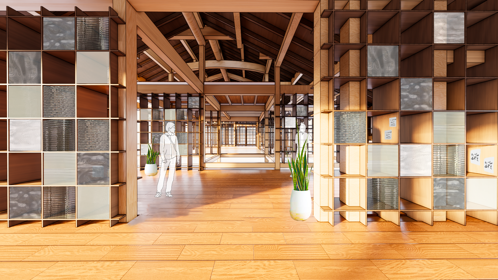
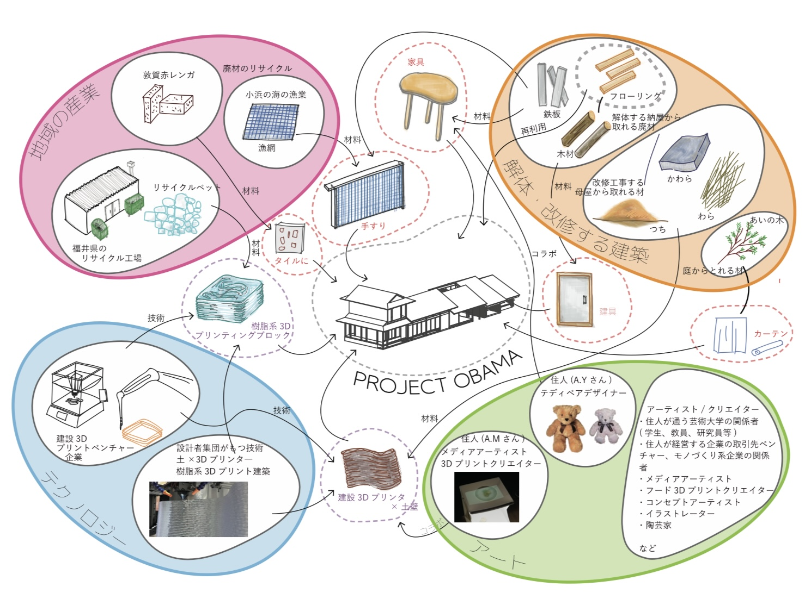

## プロトタイプのおもちゃ箱

アーティスト、地域産業、3D プリンターがコラボして取り組む建築の改修の基本構想-

海と山林に囲まれた地域に建つ住宅の改修を提案する。
家主がいなくなった住宅をアーティスト夫婦が住み継ぐ形で居住し、制作に没頭している。知人のアーティストらも滞在し、環境に刺激を受けながら制作する日常がある。

住人や滞在者からの「アートと生活の場を混ざり合う空間としたい」「コラボレーションを促したい」という想いを元に議論と試行錯誤を繰り返しながら進める。

Date：2024.06 
Category：Architecture
