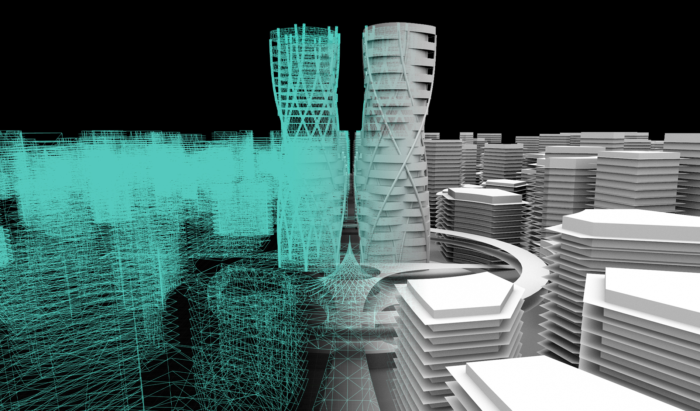

# UnravelFuture

2020 年 5 月 22 日

豊田啓介氏の登壇する第一回電脳設計論壇での対談とそれに向けた勉強会

UnravelFuture では、[noiz architects](https://noizarchitects.com)が取り扱っている「[Diagram for Expanded Dimension of Architecture](https://noizarchitects.com/archives/works/diagram)」「[物質と情報が重なる共有領域としてのコモングラウンド](https://noizarchitects.com/archives/works/where-digital-world-and-physical-world-meet)」の 2 つのダイアグラムを分析を行った。

オープンディスカッションまでの勉強会のアーカイブ

[第 0 回](https://note.com/nd3m_archive/n/n85fefb389945)
ざっくばらん

[第 1 回](https://note.com/nd3m_archive/n/nc9cbedb1b328)
物質と情報が重なる共有領域としてのコモングラウンド」を分析する。

[第 2 回](https://note.com/nd3m_archive/n/n61fb98e0bd06)
分析を踏まえてダイアグラムをアップデートしていく段階に入る。

[第 3 回](https://note.com/nd3m_archive/n/nf266dd421bd7)
具体的なプロジェクト・建築から「Diagram for Expanded Dimension of Architecture」の黄色い矢印を分析する

[第 4 回](https://note.com/nd3m_archive/n/nebface74cf47)
「Diagram for Expanded Dimension of Architecture」を読み解いていった過程で出てきた疑問などをもとに、よりよい表現方法を探る。
