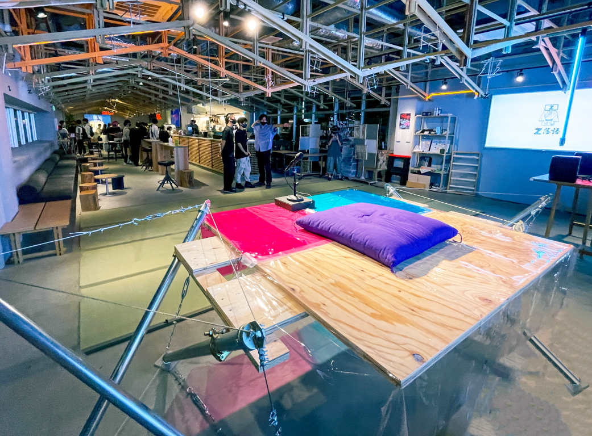
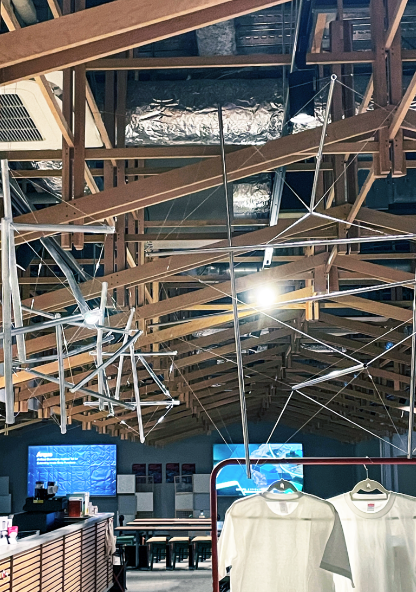
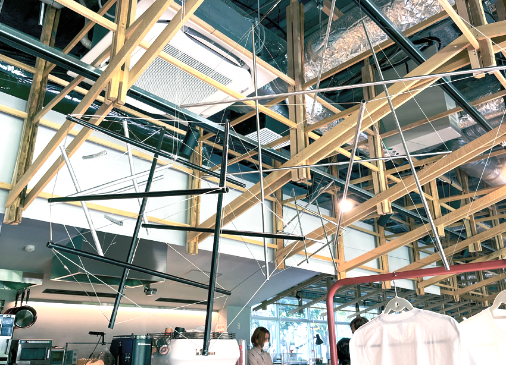
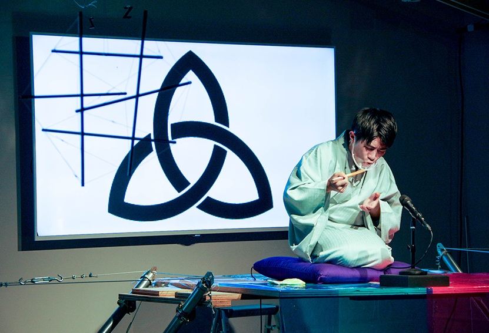

Z世代の落語家・桂枝之進が主宰するクリエイティブチーム［Z落語］主催で行われた，落語とクラブカルチャーをミックスしたイベント「YOSE Nagoya-by Z落語」における会場設計プロジェクトです．寄席に不可欠な高座と提灯を再解釈し，テンセグリティを用いて新たにデザインすることで，伝統と近未来感の融合を目指しました． 

#### テンセグリティによる高座と提灯

線の圧縮材ワイヤーのみで構成されたシンプルなテンセグリティが，Zのモチーフを想起させます．また，テンセグリティの持つ浮遊感と緊張感が生み出す新しい空間性が，クラブと落語の融合の場にふさわしいのではないかという仮説を立てました． 
寄席のアイコンでもある高座と提灯，これらをテンセグリティを用いて制作することで,落語の伝統を引き継ぎつつ新しい文化の生まれる場所の象徴としての役割をもたせました．

高座のテンセグリティの制作にあたっては引張材の長さを算出し適切な張力を確実に導入できるよう，Grasshopperのプラグイン「Kangaroo」を用いて形状のシミュレーションを行っています．

テンセグリティによる緊張感のあるオブジェクトが空間に浮かびます．

 
クライアント：Z落語

Date : 2021.09  
Category : SpaceDesign, Structure