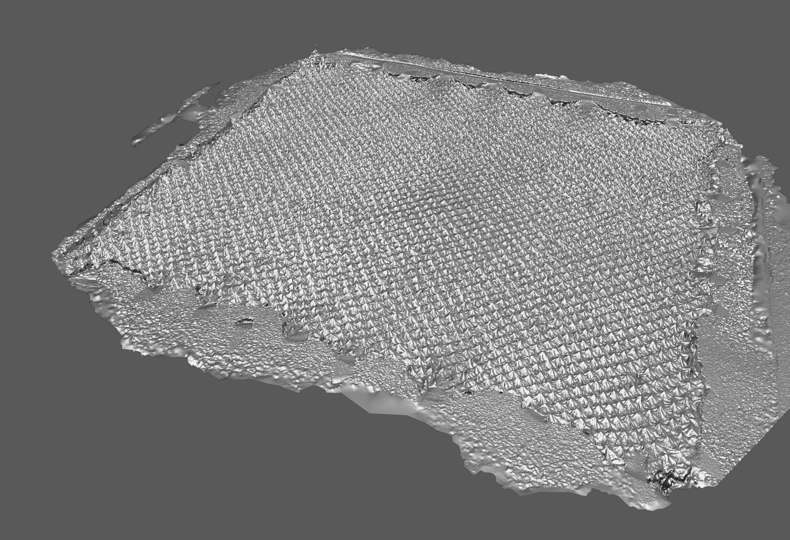
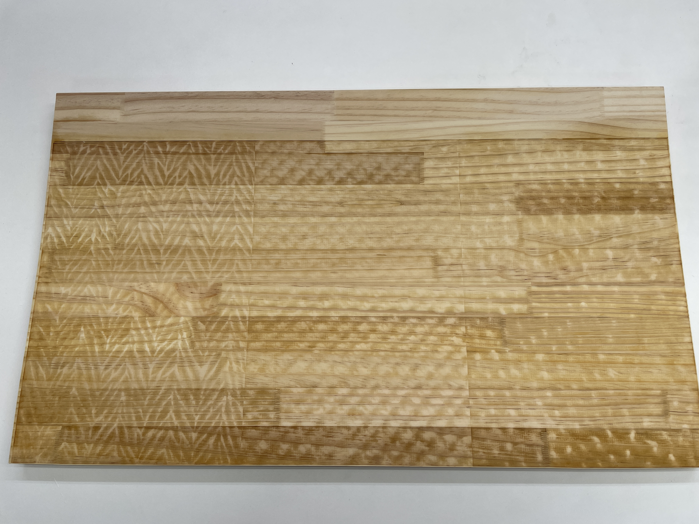
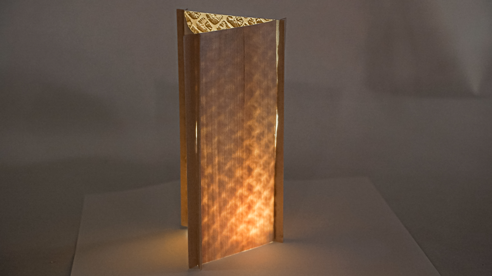
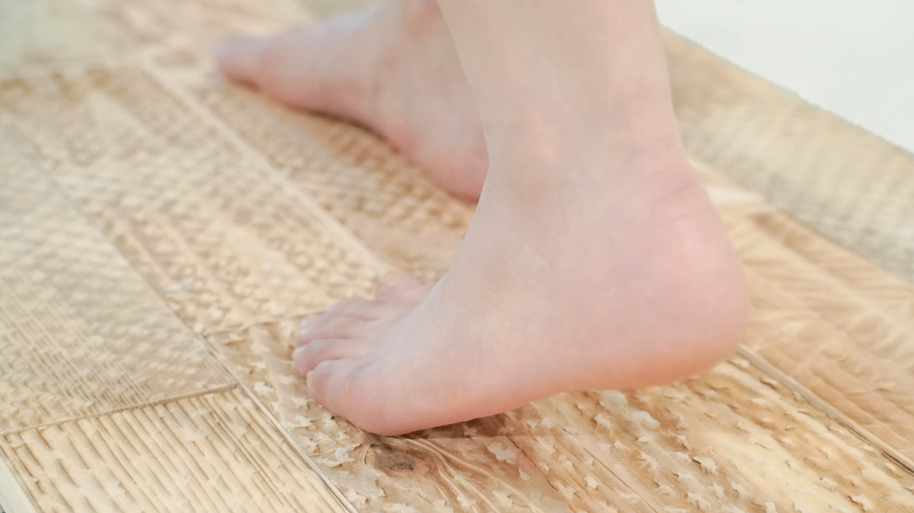
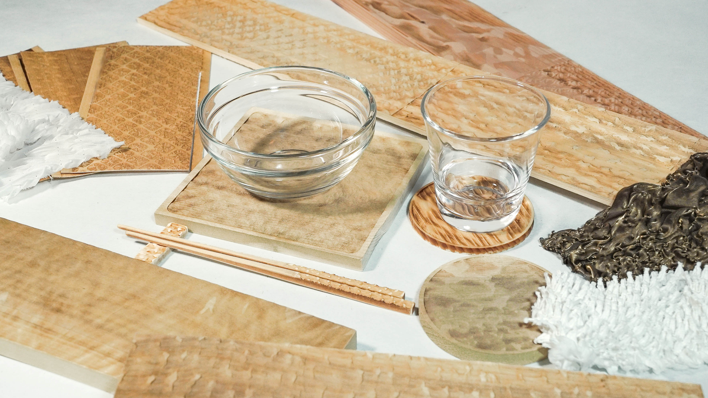
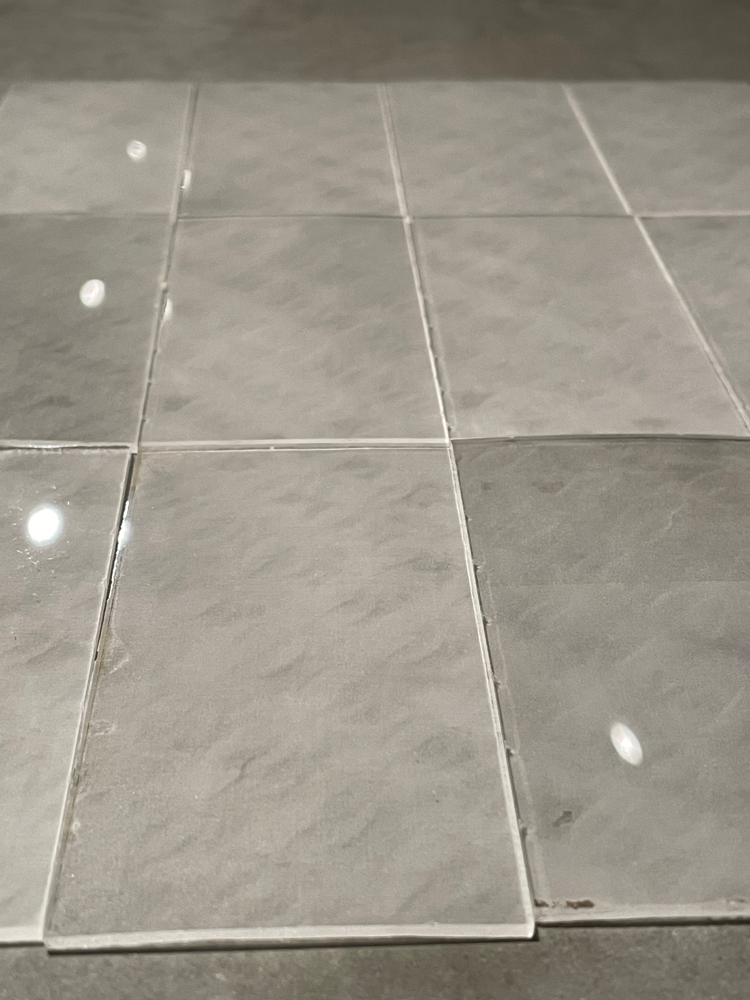

 

Wood Change Award 2020 応募作品 
[有松の転写プロジェクト](../arimatsu)に際し，ND3Mで実施したスタディをまとめ，応募したものです．

`youtube:https://www.youtube.com/embed/Htnym26a8rI`

名古屋の伝統工芸「有松絞り」の模様は，布を紐でくくる作業により生まれます，同時に,
この「くくり」によって布に生じる皺は有松絞りの大きな特徴となります．この皺による凹凸を形状記憶させることで，染の柄だけでなく形状で有松絞りの新しい可能性を示すアパレルブランド "[cucuri](https://www.cucuri-shibori.com)" が生産している布を３Dスキャンしました． 
スキャンされた３Dデータの凹凸に基づき，高さに応じたグラデーションのある画像データとし，レーザー彫刻により別の素材に転写します． 
それにより，有松絞りの様々な側面を見せ，より様々な場面で触れてもらい新たな価値を発信していくことを目的としています．また，後継者不足に直面している伝統工芸のデジタルアーカイブの役割も果たします． 
 

フォトグラメトリにより，布の表面の形状を3Dモデル化します．

木材にレーザー彫刻で皺を転写することで，木目と凹凸が重なった新しい表情が生まれます．

木材の種類により，木目と凹凸との重なり方が異なります．

新しい表情が生み出す影を楽しむランプシェードや，手触りを味わうプロダクトなどを制作しました．

アクリルに転写した内装材も制作しました．

協力： 
株式会社matomato 一級建築士事務所 
FabCafe Nagoya 
合同会社ありまつ中心家守会社 
山上商店 
cucuri

Date : 2021.02.15 
Category : 3Dscan, Material, Exhibition
