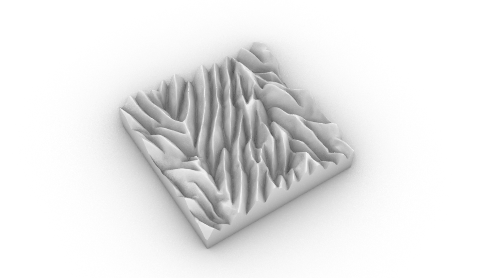
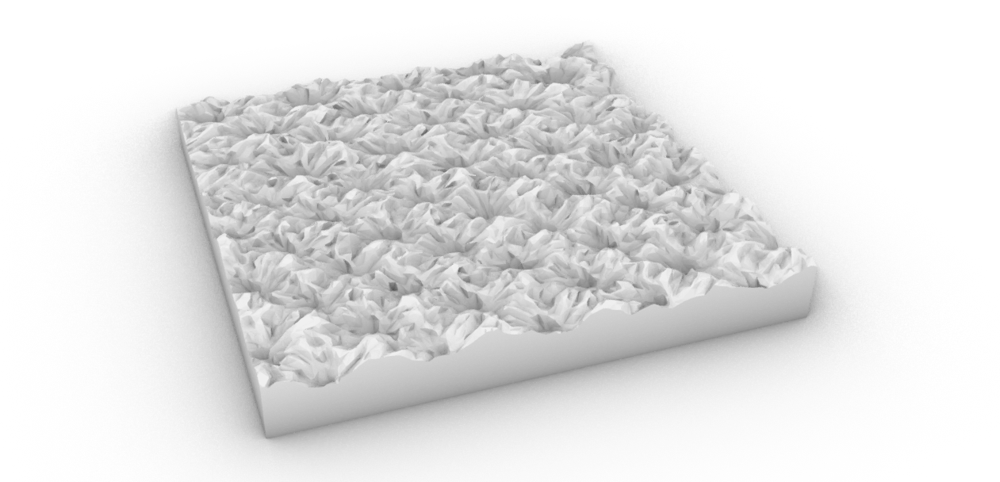
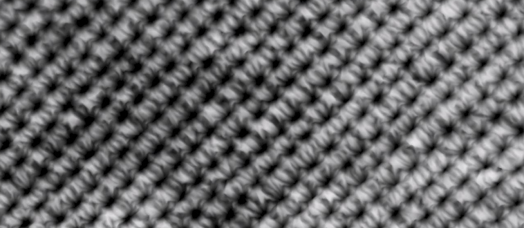
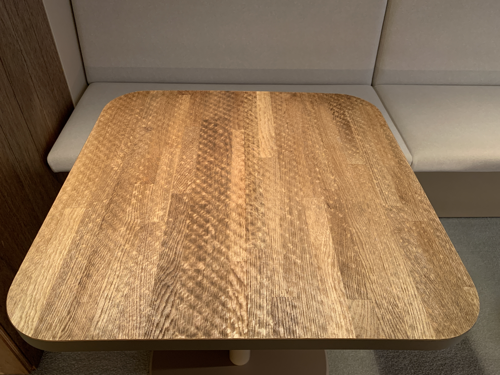
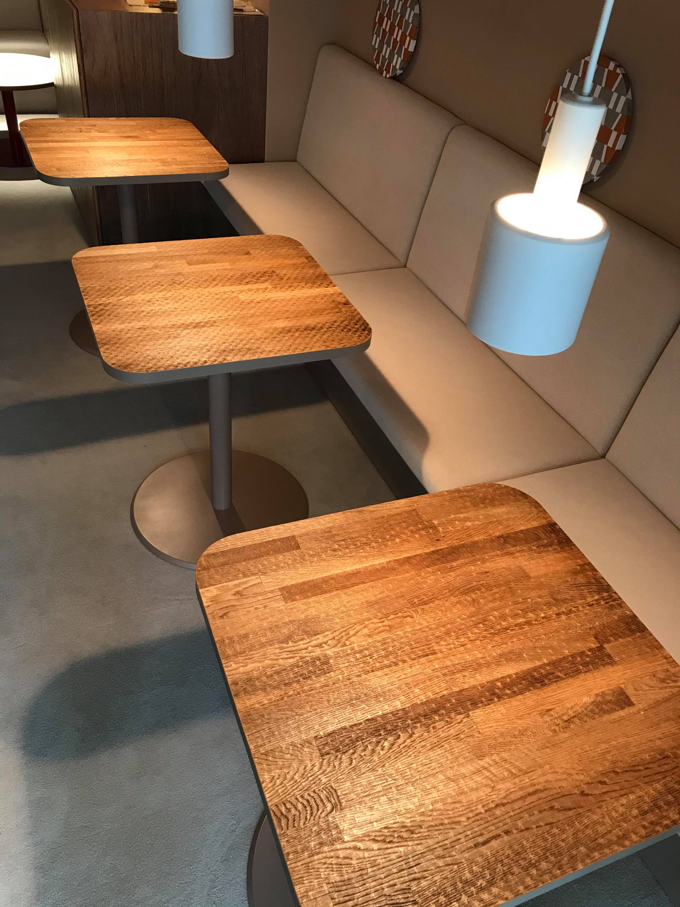

 

伝統工芸「有松絞り」には，絞りにより生じる凹凸模様があります．その凹凸を３Dスキャンし，木製の天板にレーザー彫刻したデスクを作成，[matomato](http://matomato.net)が設計した，セブンストーリーズ６階「有松の転写」の部屋に設置しました．

名古屋の伝統工芸「有松絞り」の模様は，布を紐でくくる作業により生まれます，同時に,
この「くくり」によって布に生じる皺は有松絞りの大きな特徴となります．この皺による凹凸を形状記憶させることで，染の柄だけでなく形状で有松絞りの新しい可能性を示すアパレルブランド "[cucuri](https://www.cucuri-shibori.com)" が生産している布を３Dスキャンしました． 

スキャンされた３Dデータの凹凸に基づき，高さに応じてレーザーの出力を変化させる加工データを作成し，レーザー彫刻により机の天板に転写します． 

凹凸形状と木目が重なった表情と，その手触りを楽しむことができます．

製品から要素を抜き出し抽象化することで，有松絞りの様々な側面を見せ，より様々な場面で触れてもらったり，新たな価値を発信したりしていくことを目的としています． 
また，後継者不足に直面している伝統工芸のデジタルアーカイブの役割も果たします．

クライアント：株式会社matomato 一級建築士事務所

Date : 2021.04 
Category : 3Dscan, Material
