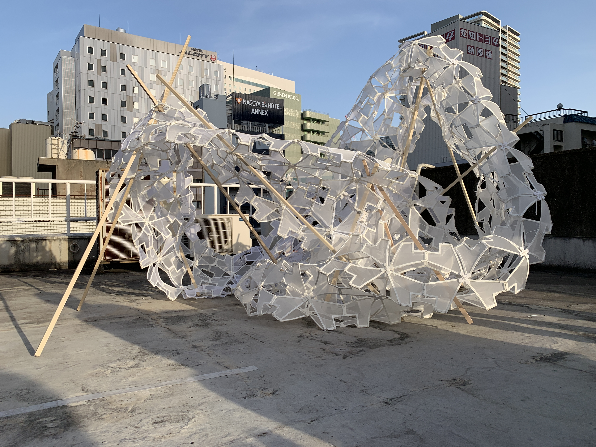

 

布と３Dプリントを組み合わせた構法を用いて作成したパビリオンです． 
条件として，エレベーターの無いビルの屋上に運ばなければならないこと，安全のため毎日撤収が必要なことがあり，軽量かつ組み立ての容易なしくみを考案しました． 

テンションをかけた布にPLA樹脂を直接３Dプリントすることで，接着剤等を使わず，膜となる布とPLA樹脂の桜型フレームを一体化させる手法を用いました．

桜をモチーフにした幾何学から，折り曲げ可能な構造をつくりました．

`youtube:https://www.youtube.com/embed/fhr-PIwdj8M`

重心の高さや全体のひろがりを目的関数とした遺伝的アルゴリズムから，最適な形態を抽出．これにより，軽量なパビリオンでありながら風に飛ばされることのない形を探索しました．

桜の花びらをかたどったパーツが組み合わさり，パビリオンの影も美しく重なります．

軽量で，持ち運び容易なため，日々形を変えて設置し空間を改変しました．

### 3D Printing

３Dプリントする際，布にテンションをかけることでPLA樹脂のフレームが自然と曲がります．

PLA樹脂の厚さと切り欠きパターンをスタディし，曲がりを実現しました，

クライアント：rhymedesign

Date : 2021.04 
Category : SpaceDesign, 3Dprint