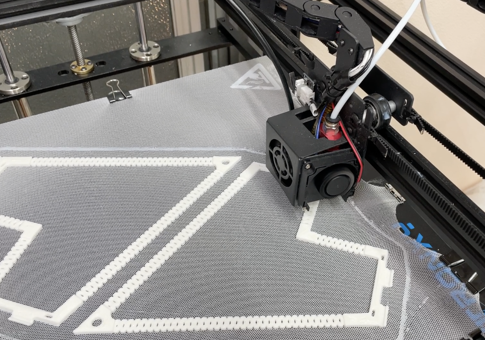
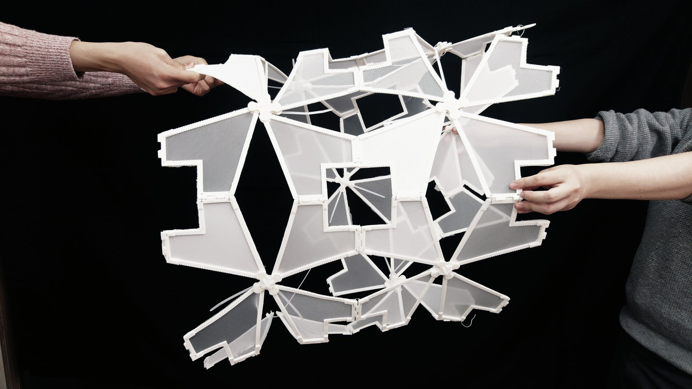
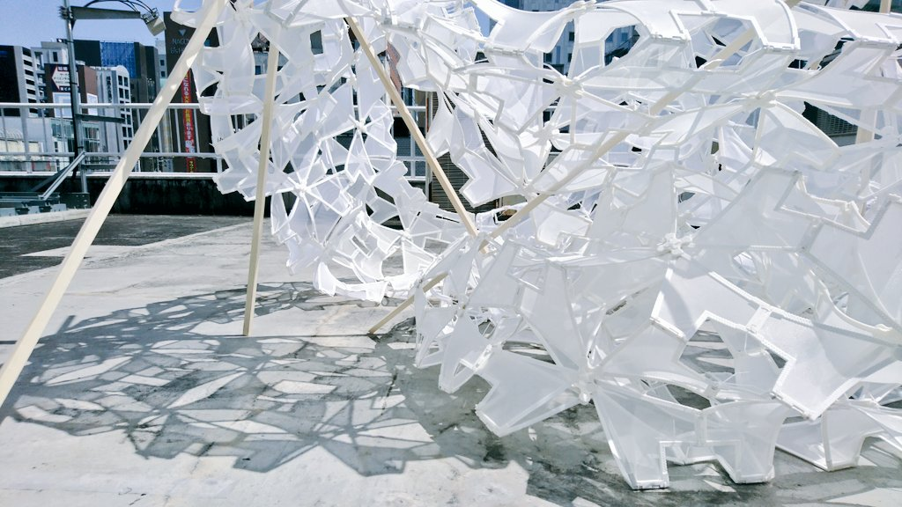
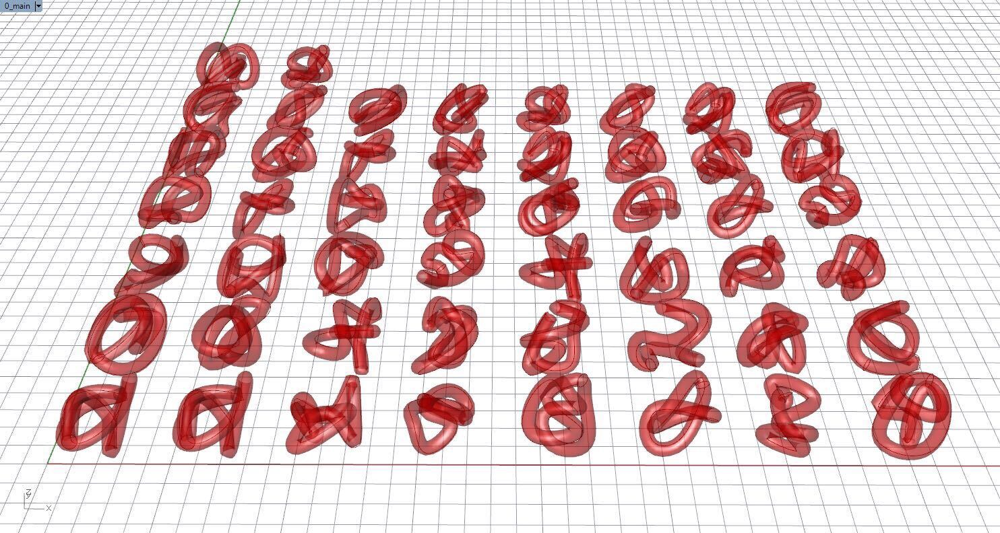
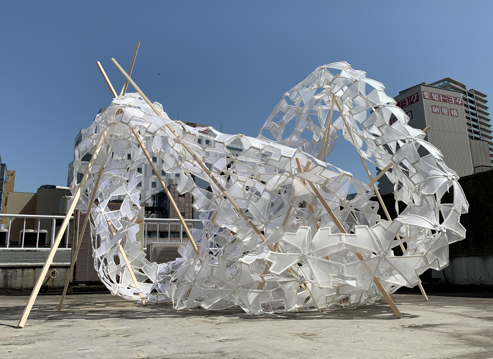
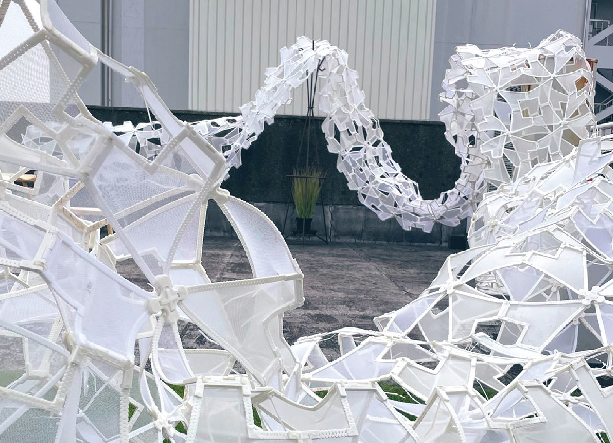
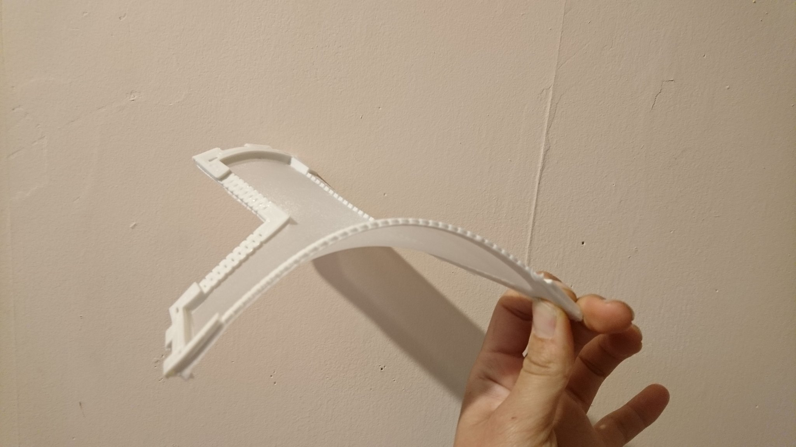
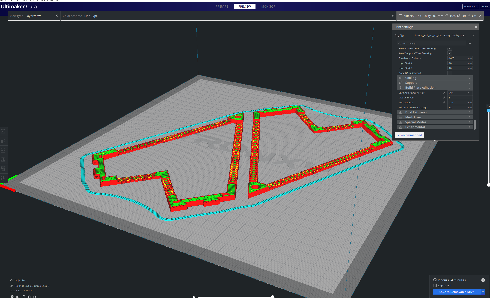

 

布と３Dプリントを組み合わせた構法を用いて作成したパビリオン。
テンションをかけた布にPLA樹脂を直接３Dプリントすることで、接着剤等を使わず、膜となる布とPLA樹脂の桜型フレームを一体化させる。

桜をモチーフにした幾何学から、折り曲げ可能な構造をつくり、施工性を高める。

`youtube:https://www.youtube.com/embed/fhr-PIwdj8M`

桜の花びらをかたどったパーツが組み合わさり、パビリオンの影が木陰を連想させる。

重心の高さや全体のひろがりを目的関数とした遺伝的アルゴリズムから、最適な形態を抽出。これにより、軽量なパビリオンでありながら風に飛ばされることのない形を実現した。

最適化した形態で実際に設置した様子

一方で、折り曲げ構造による高い施工性から、分解・組み立てが簡単になったため、毎日形を変えて展示を行った。

###スタディの様子

３Dプリントする際、布にテンションをかけることでPLA樹脂のフレームが自然と曲がる

PLA樹脂の厚さと切り欠きパターンをスタディし、曲がりを実現

Date : 2020 年 4 月
