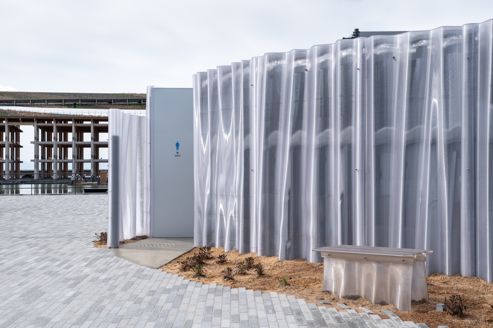
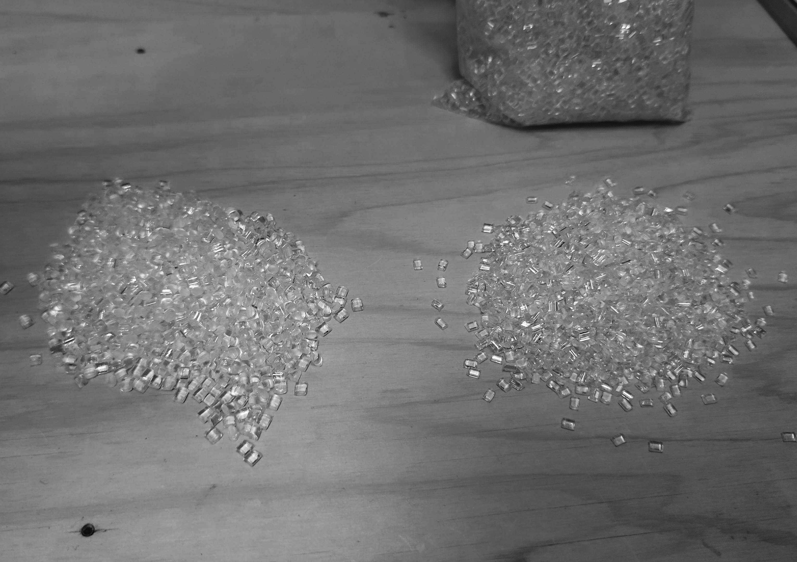
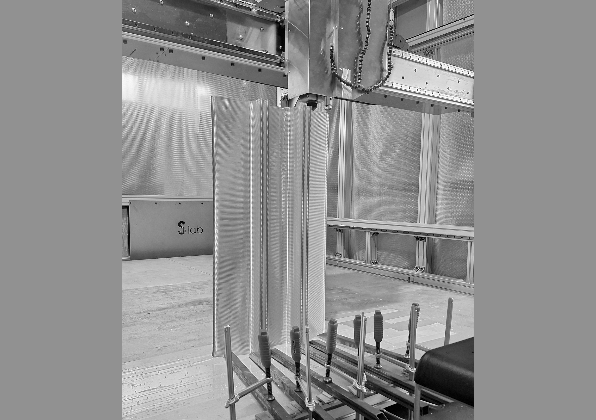
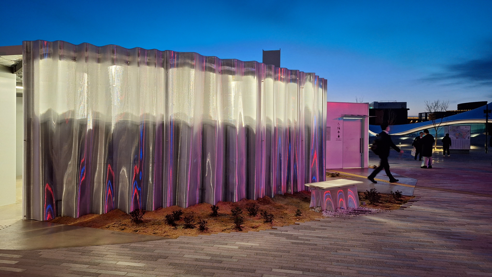
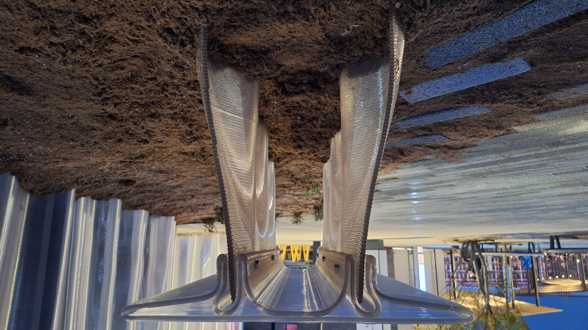

## Mirage Bench

島の小さな蜃気楼

### Design concept

「島の蜃気楼」と名づけられた建築の正面にこのベンチは置かれています。 
それはまるで建築の一部のようであり、小さな蜃気楼のようです。 
透明な樹脂からできた波のような壁面は、曖昧な輪郭をもち、周囲の風景に溶け込みます。 
この蜃気楼に座った私たちもまた景色の一部となります。 
そして空を見上げ、風を感じ、海を感じ、人類の今と未来に想いを馳せるでしょう。

There is the bench, in front of the architecture, “Mirage of the Island”.  
You may fall an illusion, like it is a part of this architecture or tiny mirage.  
The wave-like wall made of clear resin has vague contours and blends into the landscape.  
Sitting on this mirage, we also become part of the scenery.  
Look up at the sky, feel the wind, sea and ....., you think about the present and future of us.

这张长椅就摆放在一座名为 “岛屿海市蜃楼 ”的建筑前。  
它既像是建筑的一部分，又像是一个小小的海市蜃楼。  
透明树脂制成的像是波浪般的墙壁有着模糊的轮廓，与周围的景观融为一体。  
坐在海市蜃楼中的我们也成为了景观的一部分。  
我们仰望天空，感受风，感受海，思考人类的现在和未来。

### Technology

この建築とベンチは 3D プリンターを使ってつくられています。 
建築の外壁を 3D プリントするために、数多くの実験や失敗を重ねています。 
その試行錯誤の中で生まれた試作品などは砕いてリサイクルし、再び原料として生まれ変わりました。 
このベンチはそのリサイクル樹脂を用いてつくられています。

The architecture and bench were built(or made) using a 3D printer.  
In order to 3D print exterior walls of them, we did numerous experiments and failures.  
The prototypes which were born from this trial and error, were crushed and recycled, and reborn as raw materials again.  
This bench is made from that recycled resin.

建筑和长椅都是用 3D 打印机制作的。  
为了让建筑的外观能够通过 3D 打印来实现，我们进行了无数次试验和失败。  
在这些试验和失误中产生的废料被粉碎并回收，再次作为原材料重生。  
长凳也正是用这种回收的树脂制成的。

Date:2025.04 
Category:Furniture
