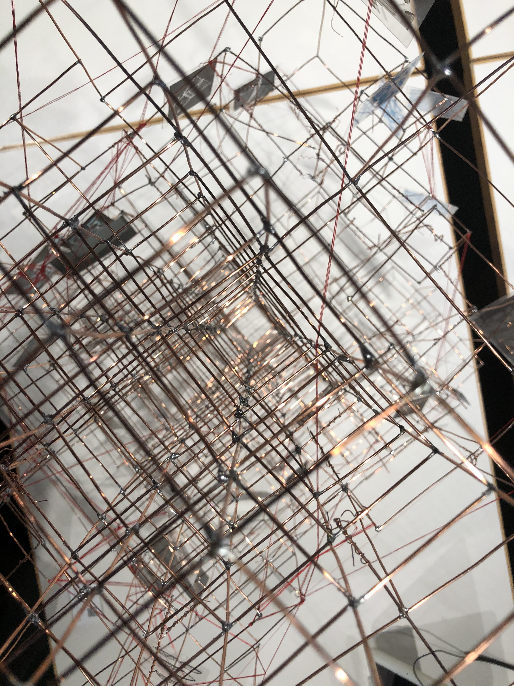
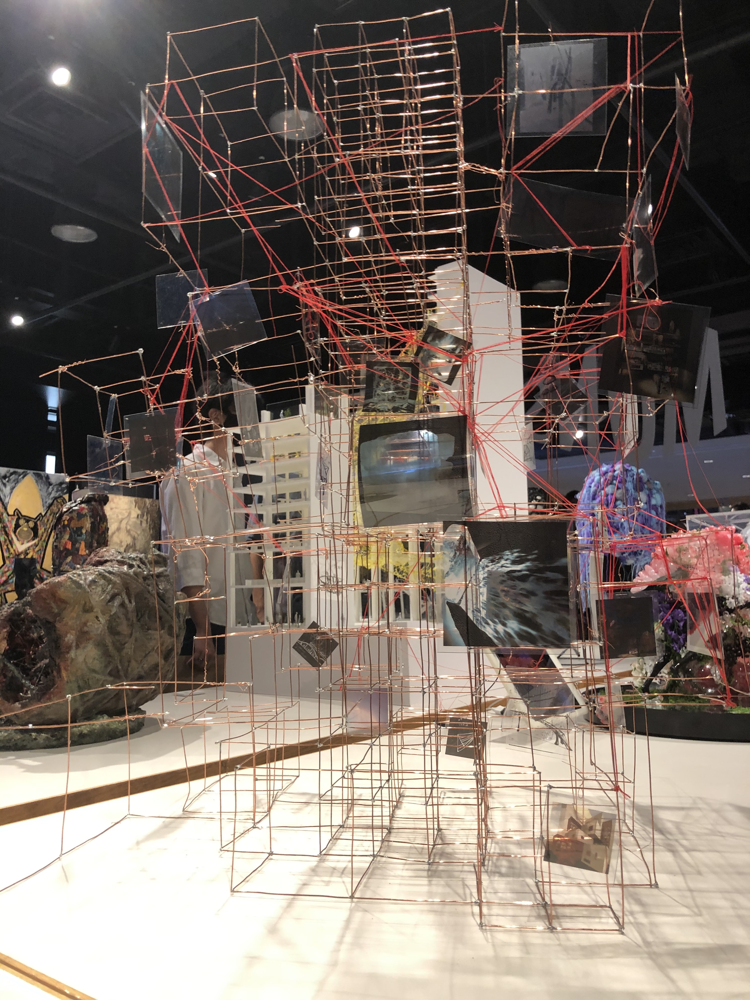
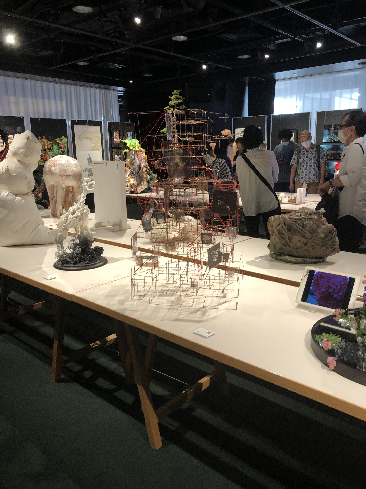

Monster Exhibition 2020 出展作品

[Monster Exhibition](https://monsterex.info/)は 2013 年に始まった，「カイジュウ」をテーマとした作品のエキシビションです．

ND3M では，カイジュウと建築からメンバーが各々発想した作品を制作し，それらの要素を分解，思考の過程を読み解き，統合することに挑戦しました．

Date:2020.09  
Category:Exhibition
