これまでの活動を振り返り，プロジェクトを体系的にまとめた展示と，ゲストとのオンライントークセッションからなるイベントを実施しました．

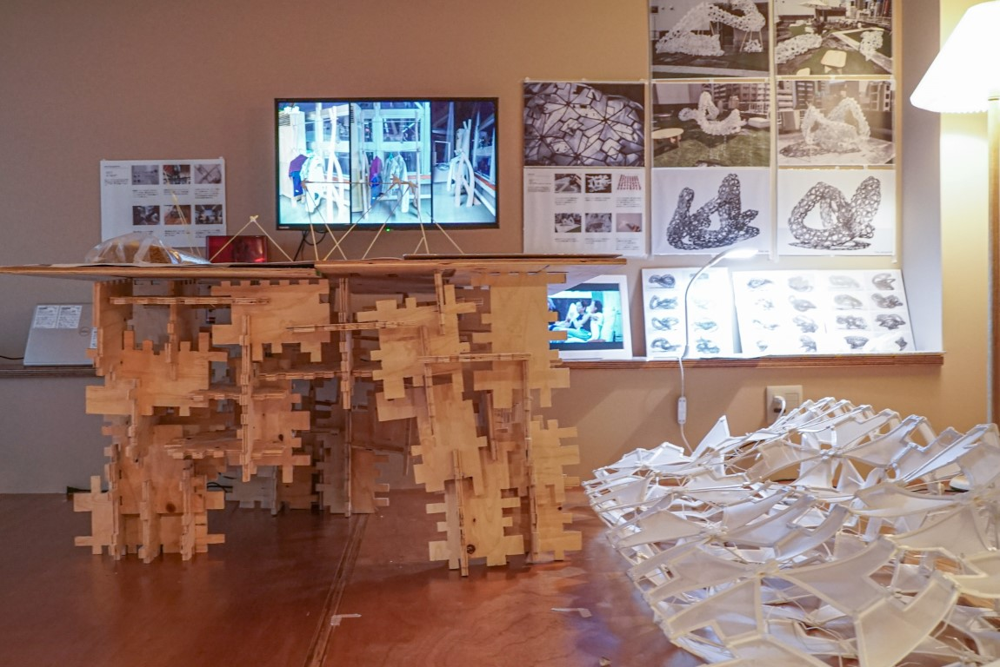

[有松の転写プロジェクト](../arimatsu) で机の天板を制作した，セブンストーリーズの一室にて，モックアップやスタディの展示を行いました．
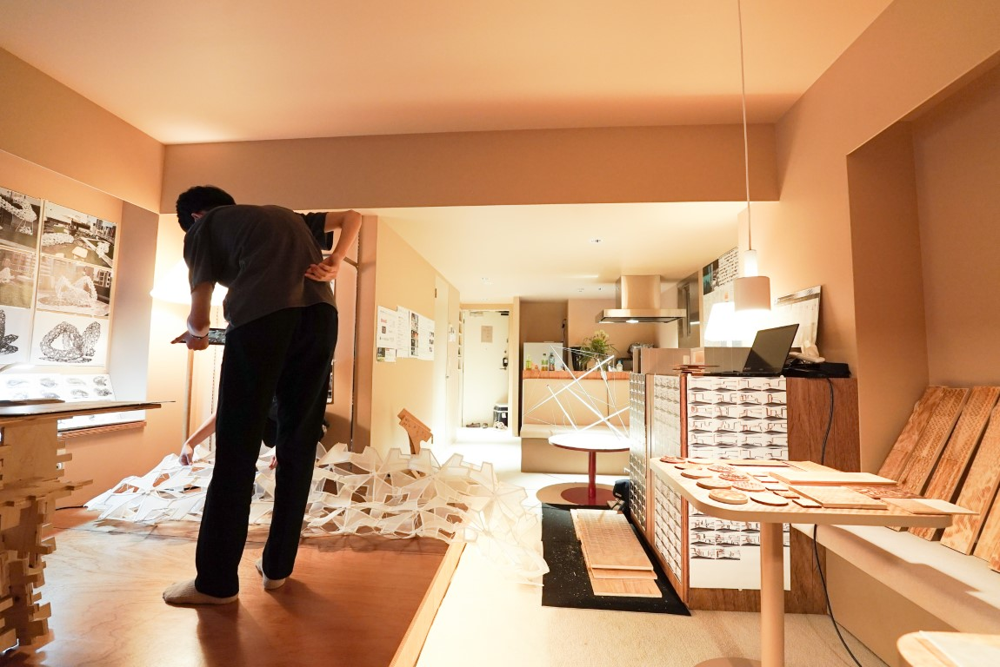

#### ワークショップ展示
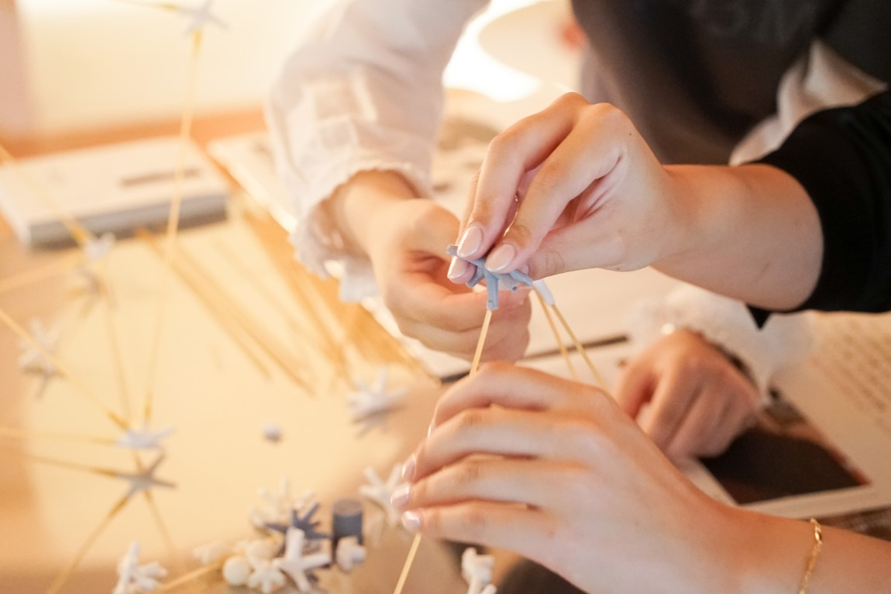
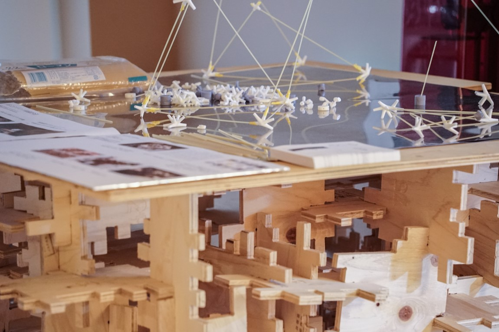

#### モックアップ・スタディ展示
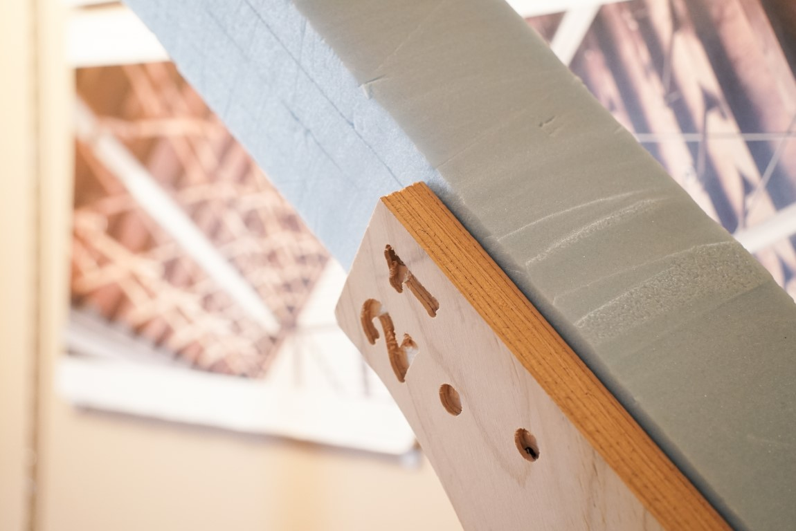
地獄組取付部材　モックアップ
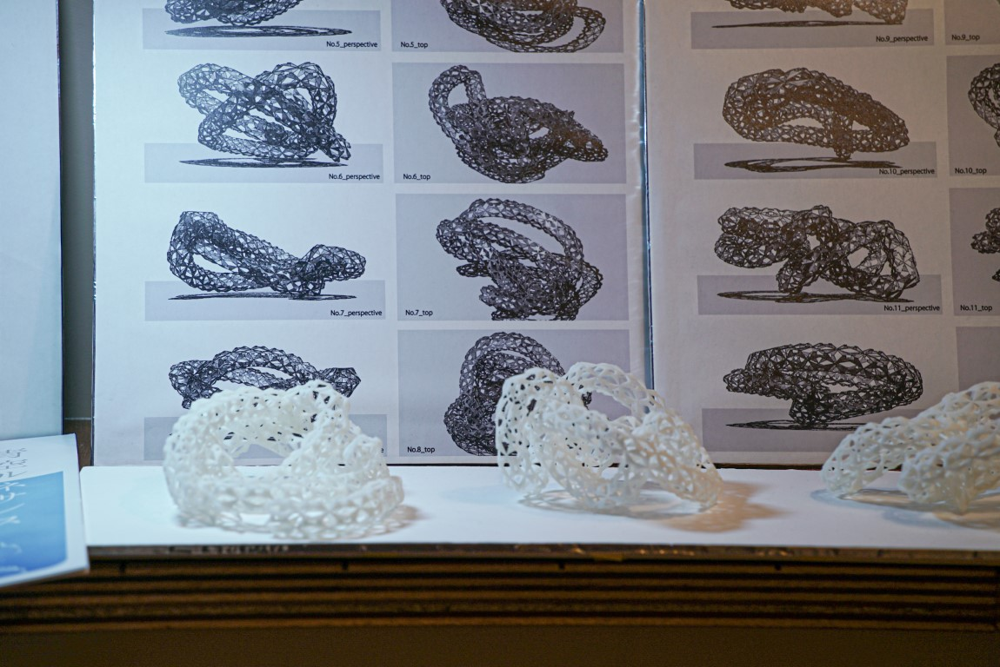
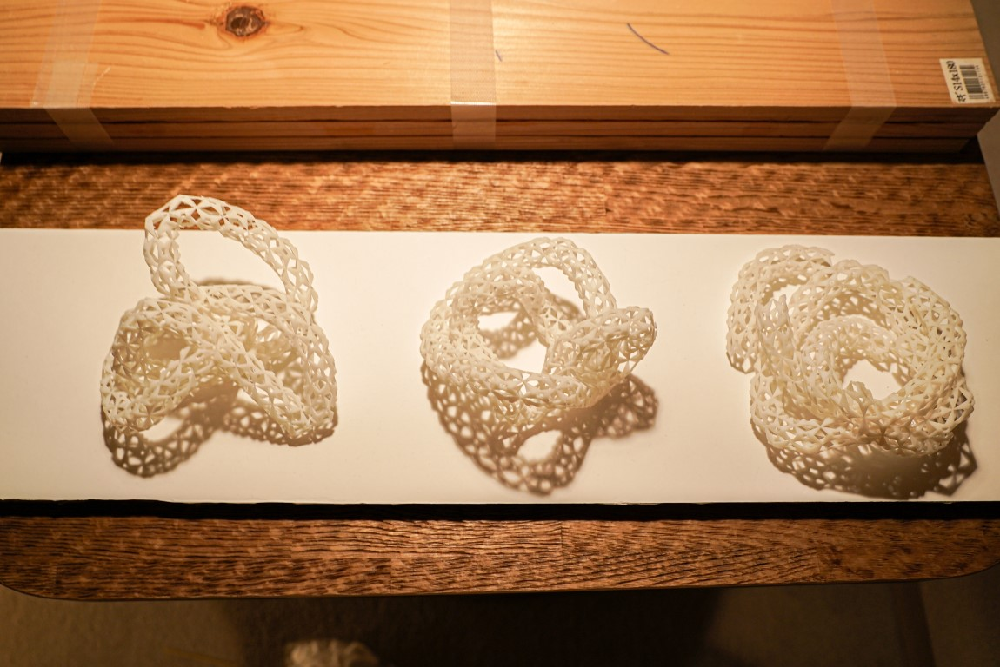
Fabrossom　全体形状スタディ
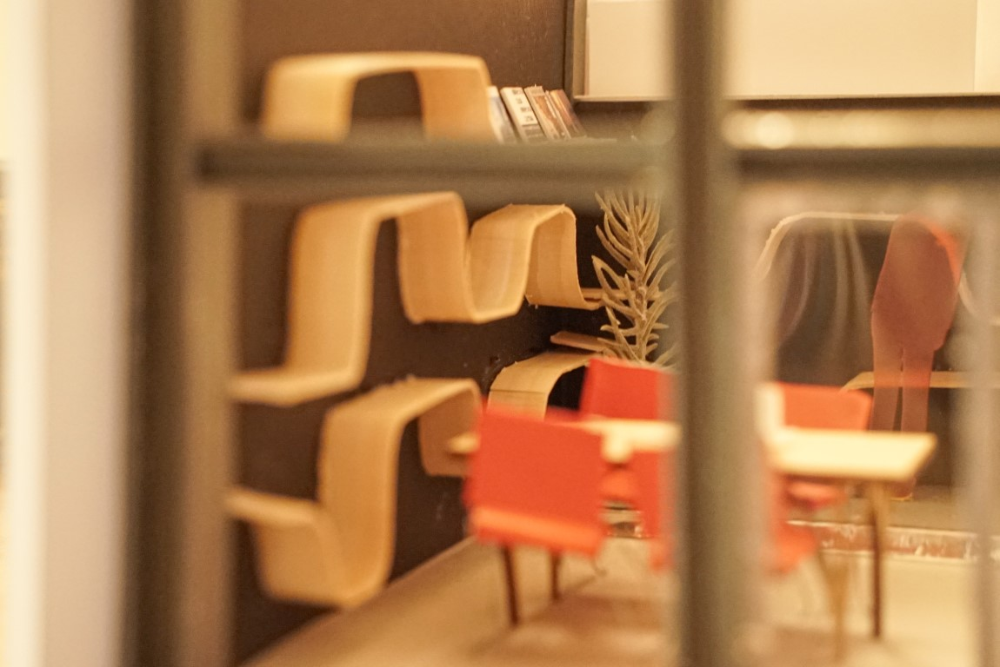
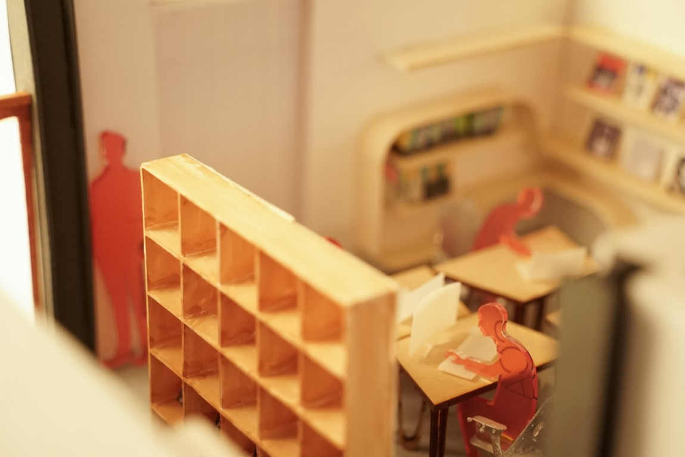
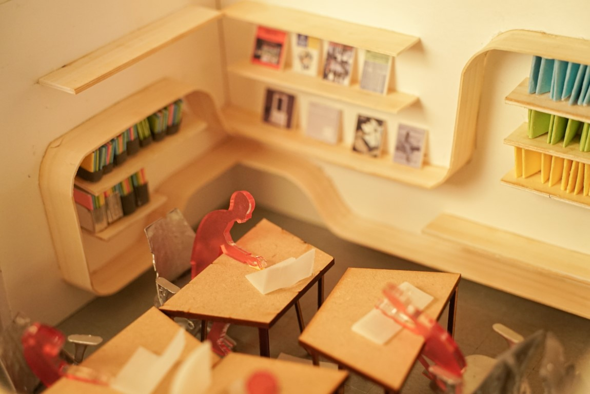
オフィス内装　模型
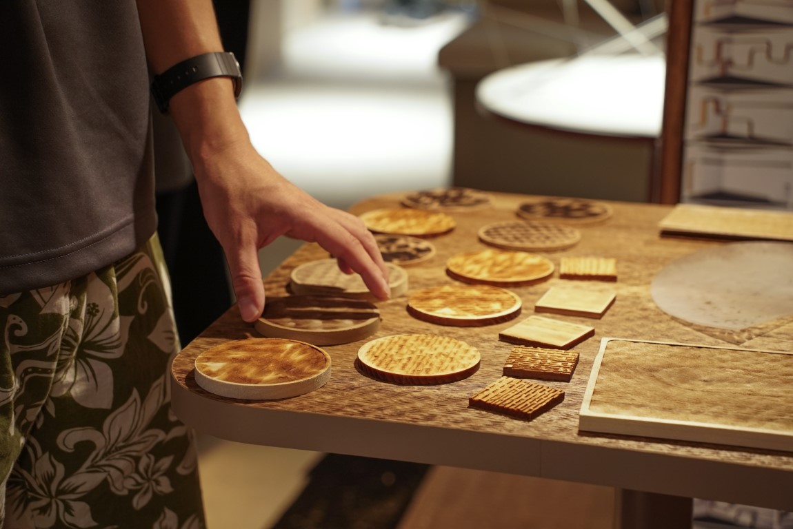
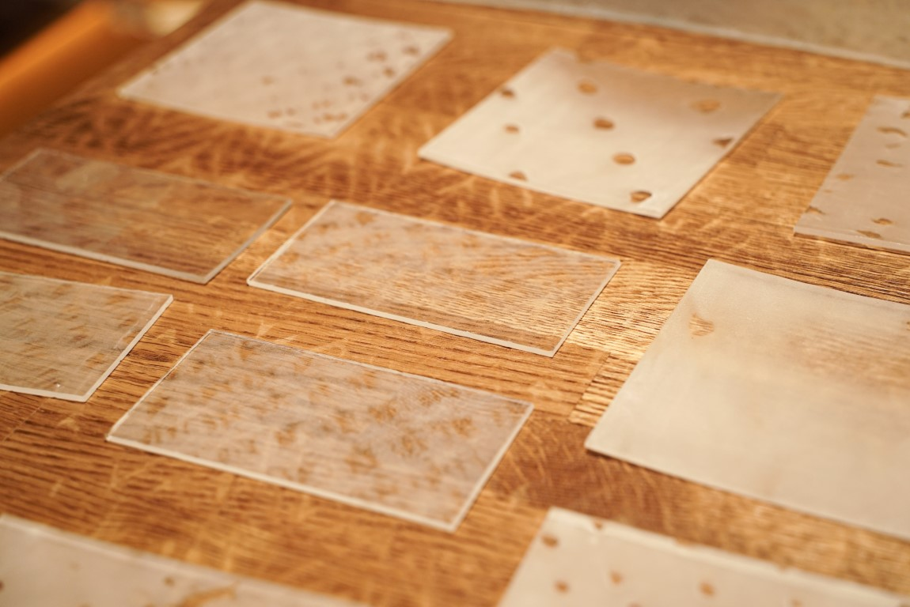
有松の転写　加工スタディ

#### 裏展示
裏展示と題し，制作過程で壊れてしまったものや製作中の写真などを展示しました．
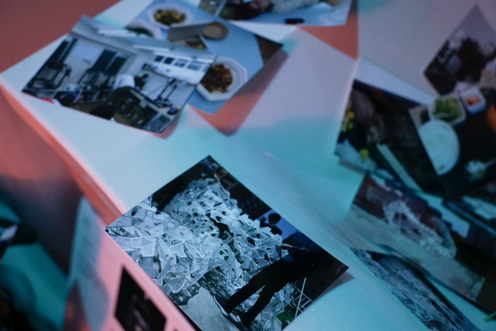
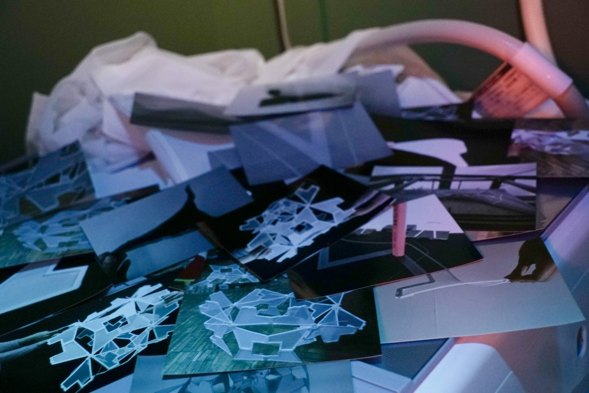
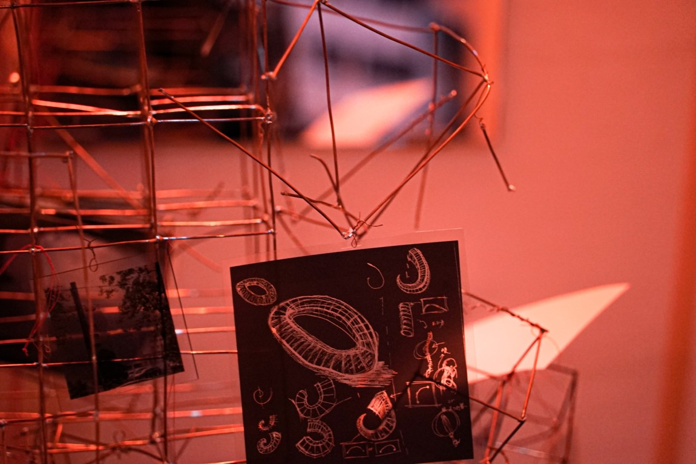

#### オンライン配信
展示期間中，ゲストを招いたオンライン配信を行いました．

* **クリエイティブの表裏**

同世代のクリエイターチームである，[積彩](https://sekisai.com)と，[synschismo](https://synschismo.com)をゲストに招き，「創ること」の楽しさに焦点をあてたトークイベントです．
`youtube:https://www.youtube.com/embed/SbGa-uYGh70`

* **ND3M-Channnel**

メンバーが個人的にゲストを招待し，トークセッションを行う企画です．
`youtube:https://www.youtube.com/embed/playlist?list=PLDiPM_qRsG-L9MeTR3kYAxr8i9unPRlqN`

 
 
 

開催場所：セブンストーリーズ6階　有松の転写

ゲスト(敬称略)

クリエイティブの表裏:  
積彩 
synschismo 

Session01: 
宇宙建築サークル(青木快大・穂積佑亮・水口峰志・長谷川 翔紀) 

Session02: 
高木秀太 

Session03: 
浅井睦氏 
大庭拓也 

Session04: 
石澤宰 

Session05: 
佐藤優太郎 

Session06: 
三田地博史 

Session07: 
建築いどばた会 

Session08: 
松本杏奈 
魚住晴香 
 

Date:2021.09 
Category:Exhibition
