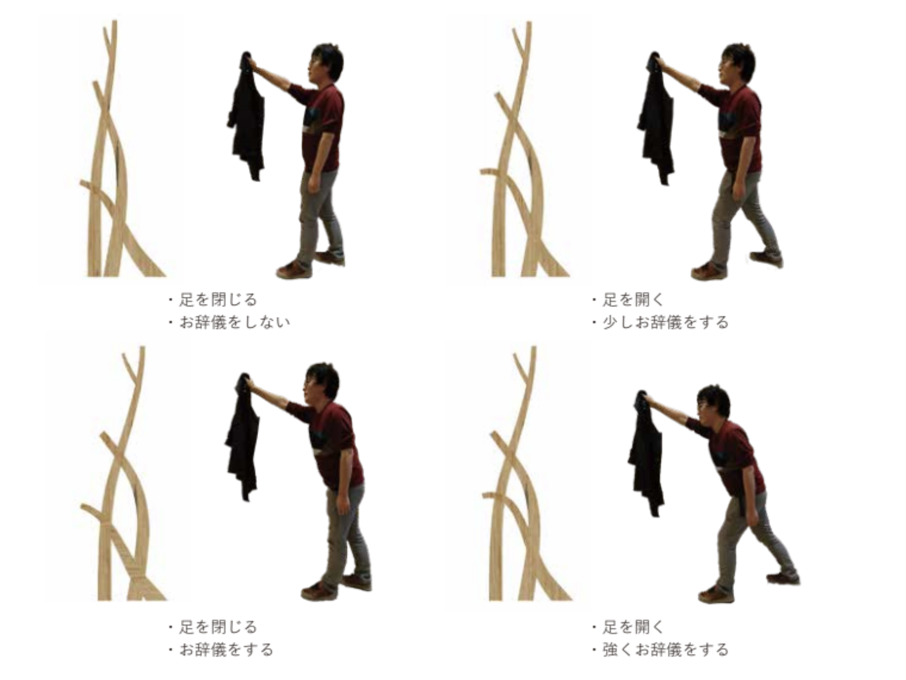

 

センサーから取得した値を用いて、作業着かけをデザインする試み

#### センサーで取得した値を用いてモデリング

マイコンやスマートフォンの 6 軸の加速度センサーを使用し「お辞儀する」動作の角度をセンシング。

Grasshopper Firefly と Arduino を連携また Grasshopper と ZIGISM 連携しスマホのデータをもとに基準となる曲線を曲げて調整することで、Grasshopper のスライダーではなく体を動かすことでモデルをパラメトリックに変化させリアルタイムにモデリングが変化するプログラムを組んだ。

#### デザインワークショップ

メンバーが自作したリモコンを装着し「お辞儀する」というカラダを動かす動作をもとにモデルを感覚的に動かしてもらいながら、適切な作業着掛けをかける高さ、幅を決める。

#### EMARF で加工

EMARF サービスを利用して加工する。

感覚的にデザインしたものをモデルデータをそのまま変換し CNC マシンでモデル通りのものを正確に制作。

 

Date : 2020 年 8 月 4 日  
Category : Product
