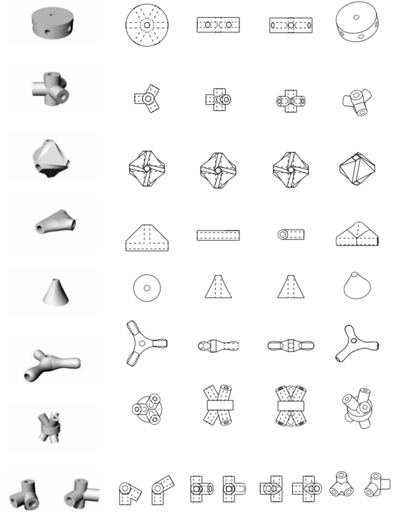
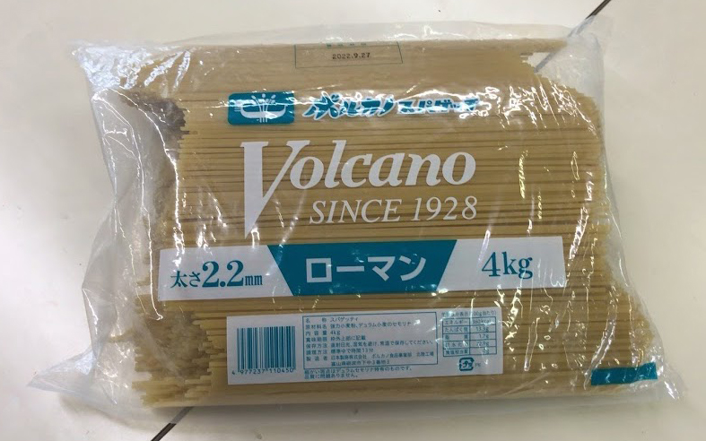
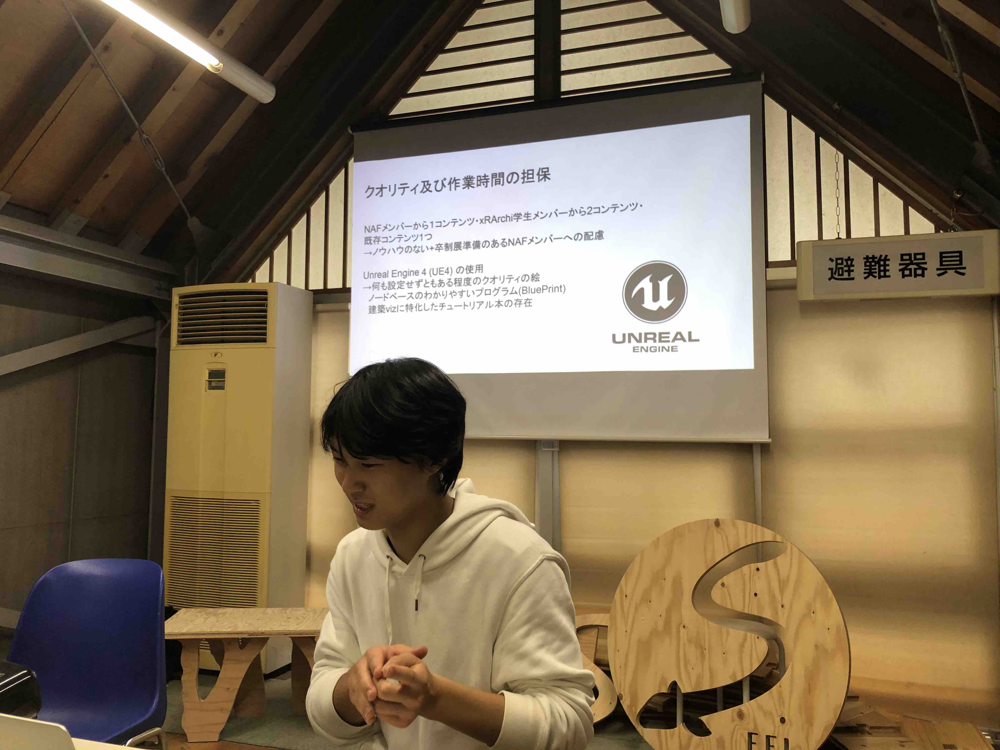
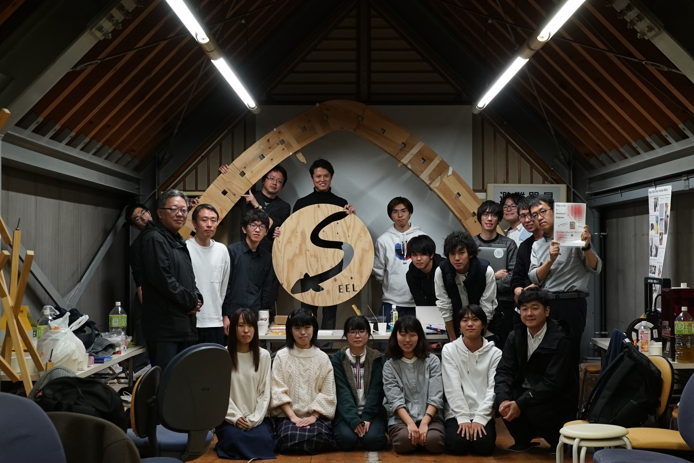

通常パスタタワーはマシュマロをジョイントとして制作するが、予め形が決められたジョイントを、3D プリントで作成したら、どのような構造ができるだろうか。

初めてモデリングする人から構造の専門家まで、多様な人の集まるデジファブワークショップと交流会を開催した。
 　  　 

名古屋周辺から参加者を募り、事前にそれぞれがジョイントのデータを作成した。
Graahopper でパラメトリックにデザインしたり、ジェネレーティブデザインを用いたり、様々なジョイントが集まった。

開催当日は、WS の参加学生 15 人と 4 名の建築家や先生、加えて 3 人の見学者を交えてチームに別れ、制作と講評を行った。

WS の後は参加者それぞれが今までかかわってきたプロジェクトや研究、設計,
興味のプレゼンと、交流会を行った。

`youtube:https://www.youtube.com/embed/BCpumtefko4`

　

Date : 2019 年 11 月 24 日  
Category : Workshop
