#### すやりがすみ

> 大和絵、特に絵巻物で、横に長く棚引く霞。鎌倉時代以降、遠近感を与え、また場面を転換するために用いた。
>
> ---デジタル大辞泉

  

（_ _ _ _ _ _  
　　　 　　 ）　 
　　　　（ _ _ _ _ _ _ _ _ _ _ _  

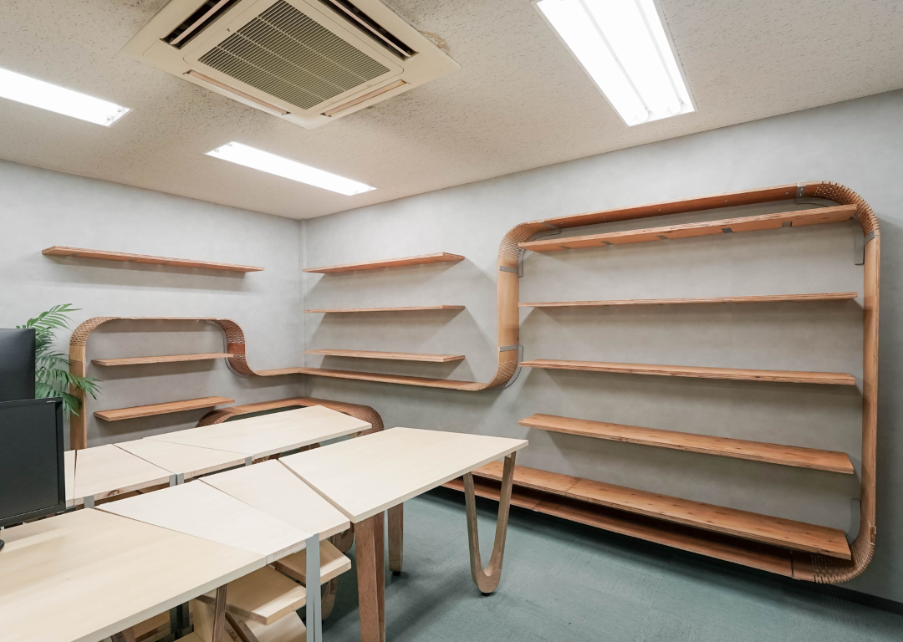

構造設計事務所のオフィスを，働き方の変化に対応させるためのリノベーションプロジェクト．木材やアクリルなどの硬い板材を切り欠くことで曲げることができる技術，kerfbendingを用いて「帯」を纏った統一感のある空間をデザインしました．曲げ加工を施した板を壁に取り付け，空間を取り巻く帯のような棚を作成しました．同時に製作したデスクもkerfbendingを用いた脚とすることで，曲線美を持つデザインを実現しています．

Processing+igeoによるエージェントアルゴリズムを形態生成に採用し，棚を構成する木材の帯の形状を生成し，数百パターンのなかからスタディを行いました．棚として成立するための条件を指定しつつ，エージェントの行動によってランダムに生成された棚の配置計画となっています．

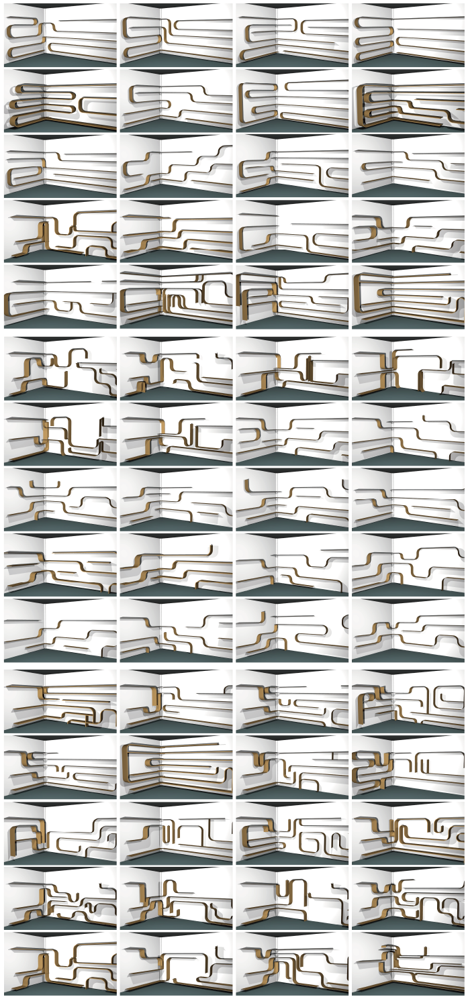

生成した棚の形状は，Kerf Benfingを施した柔軟に曲がる部材で実現しています．

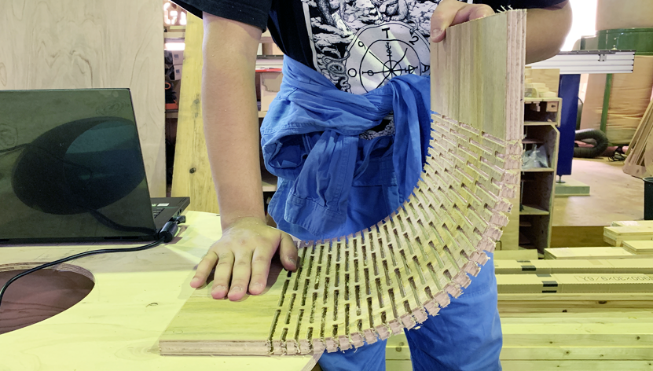

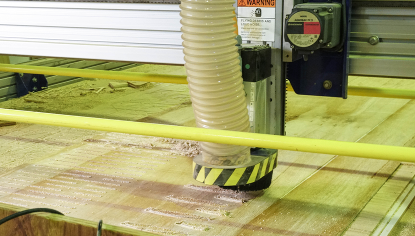

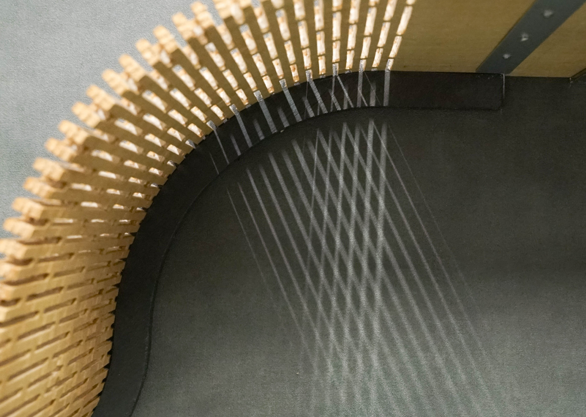

#### 応接空間

生成した帯状の棚と，細く繊細な脚のテーブルを制作しました．

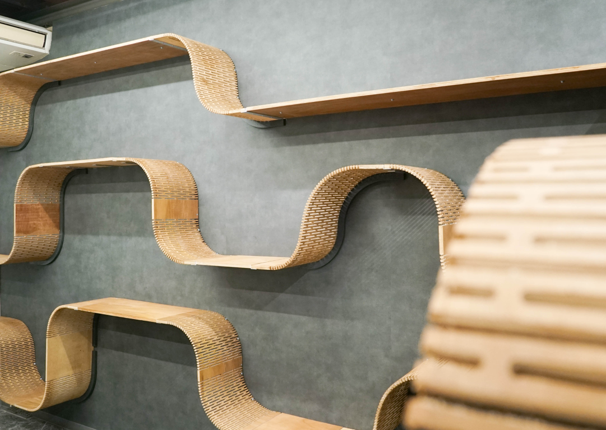

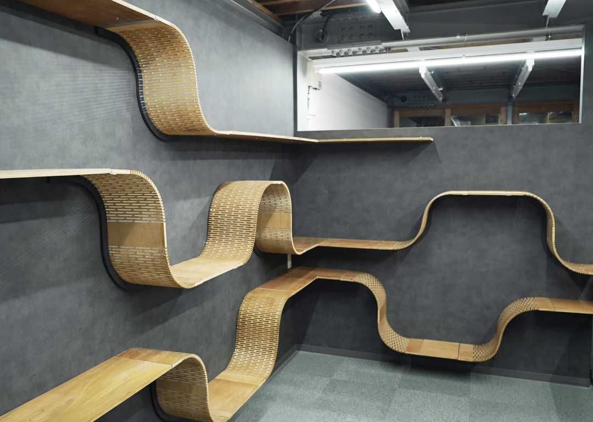

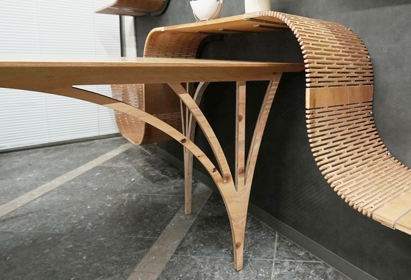

#### 執務空間

デスクの脚にもベンディングを採用し，曲げ木による曲線の美しい空間としています． 
デスクの形状は台形でデザインし，同時に製作したサイドテーブルと組み合わせることで，働き方に合わせた様々な配置を可能としています．

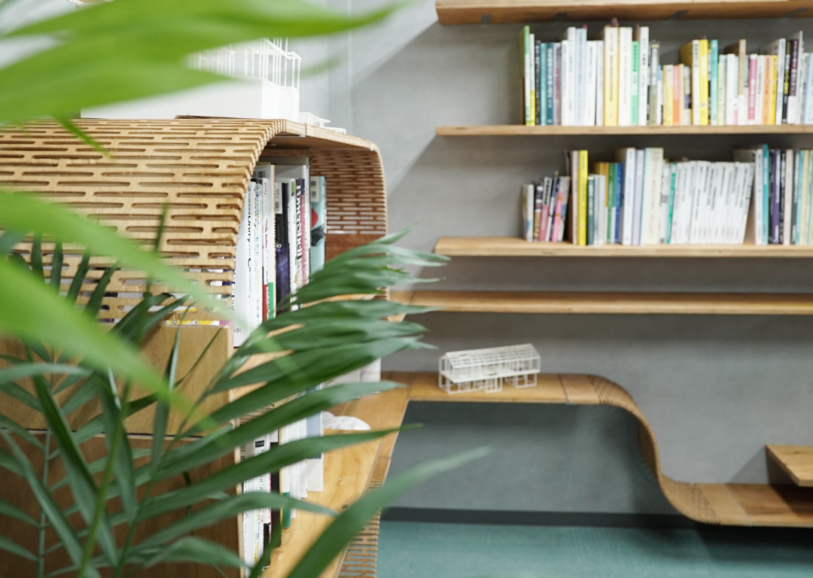

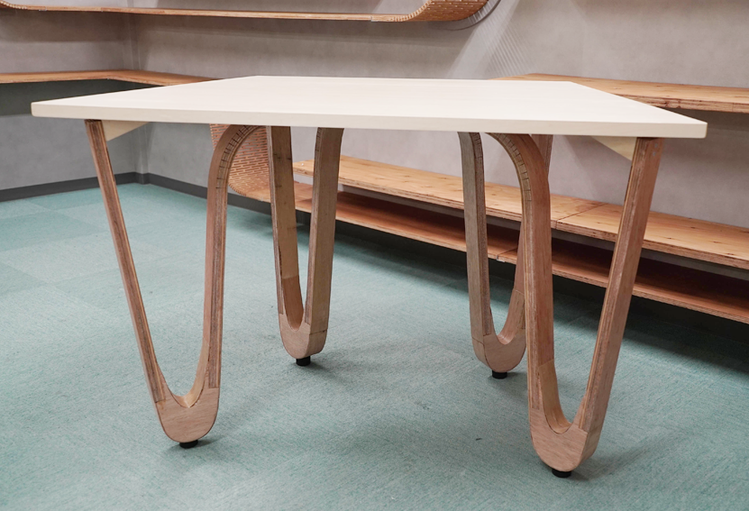

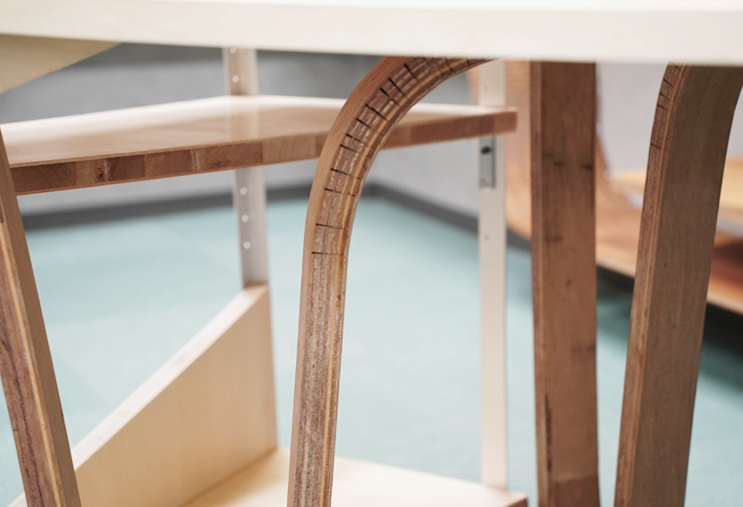

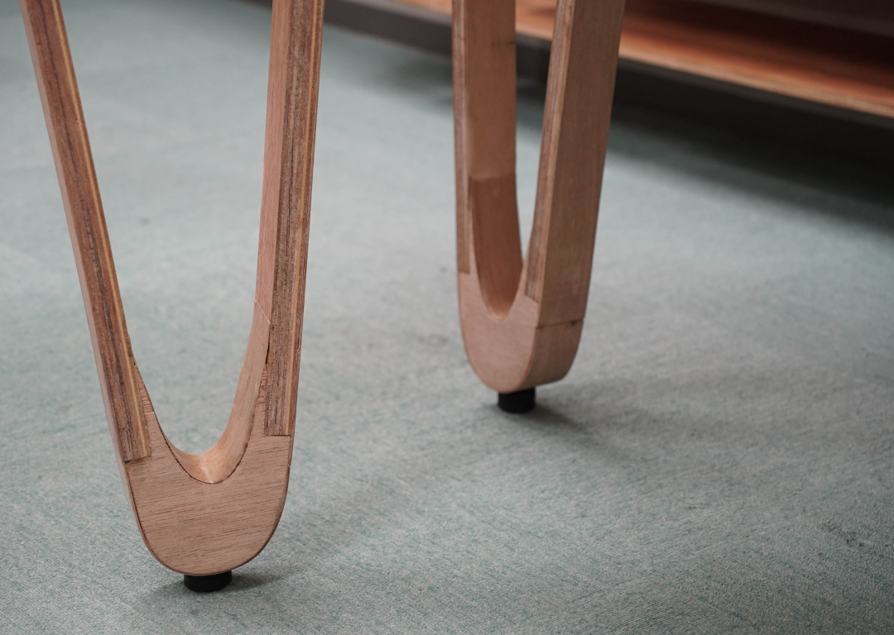

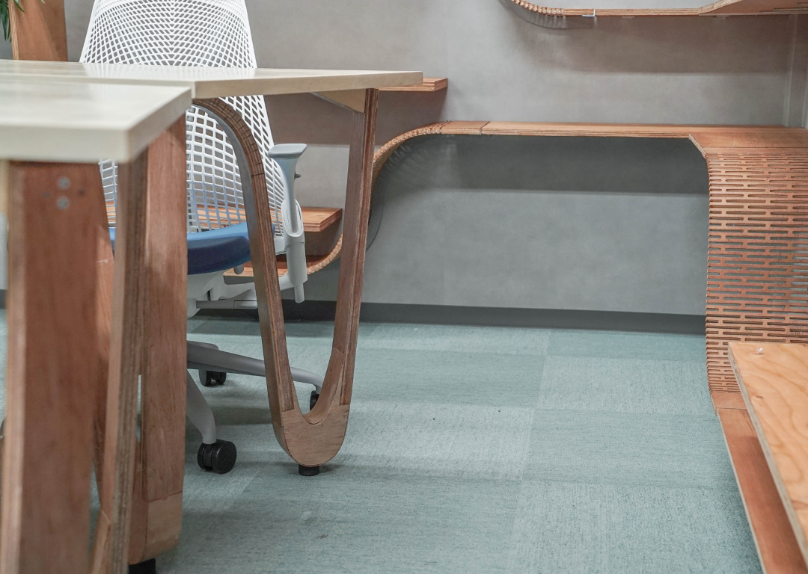

 
 

クライアント:株式会社ディックス

Date:2021.09 
Category:Office, InteriorDesign, CNC

