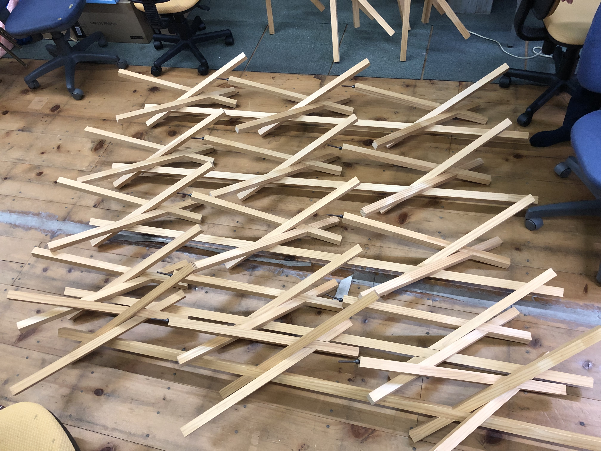
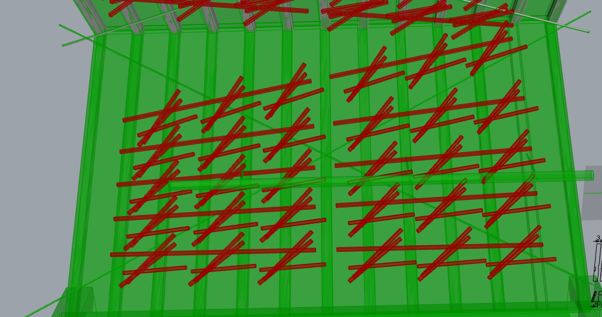
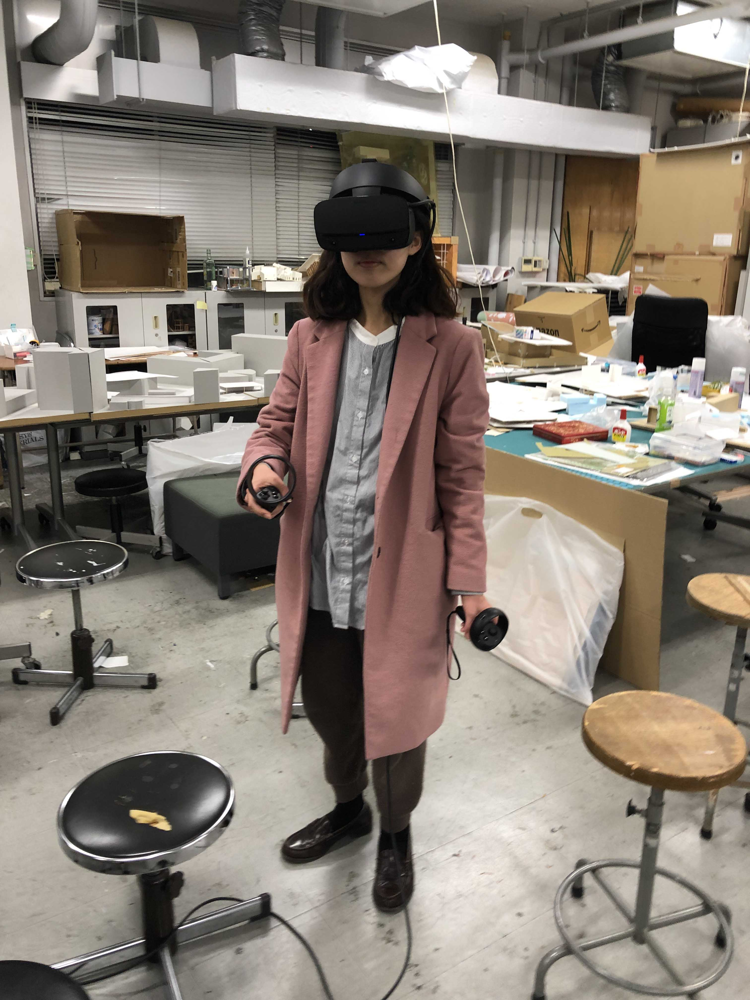
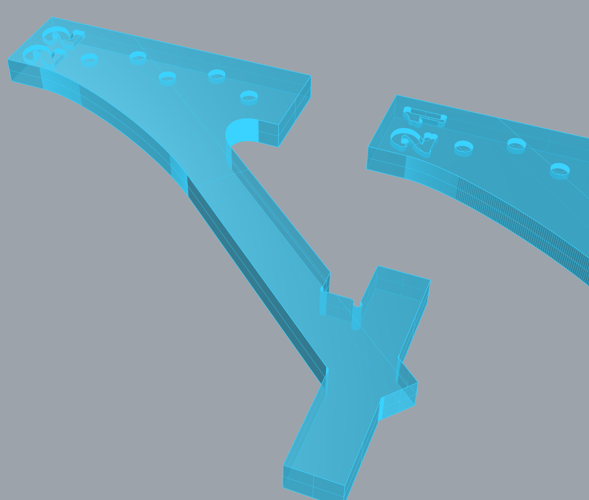
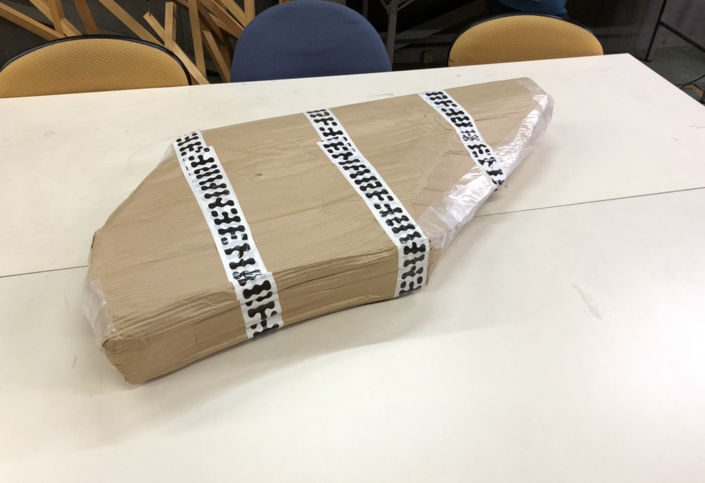
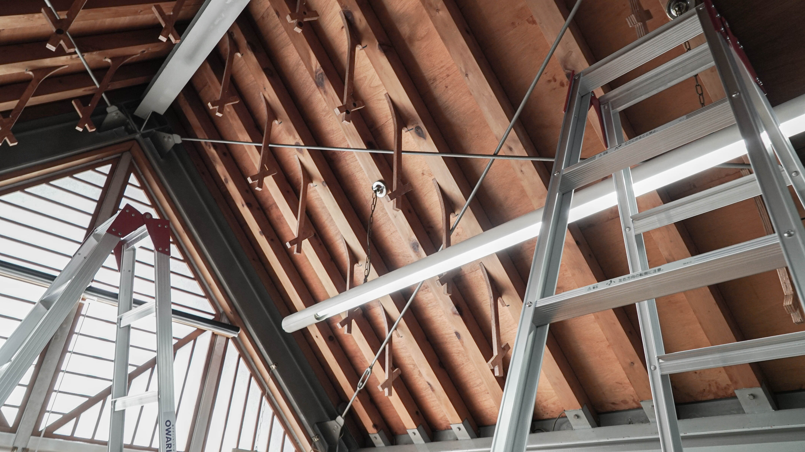
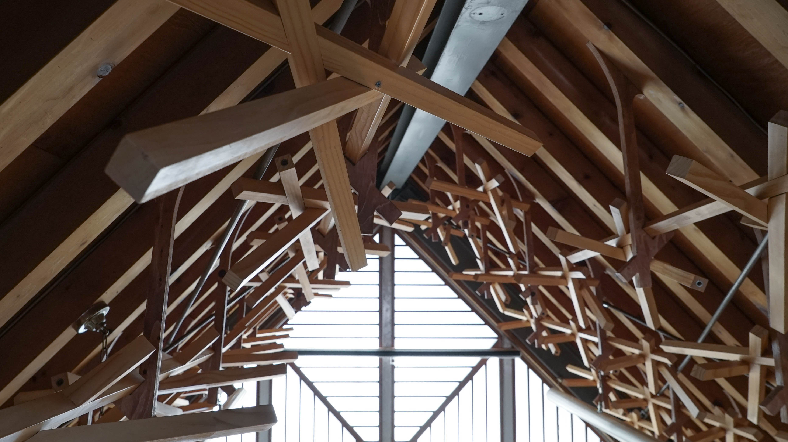
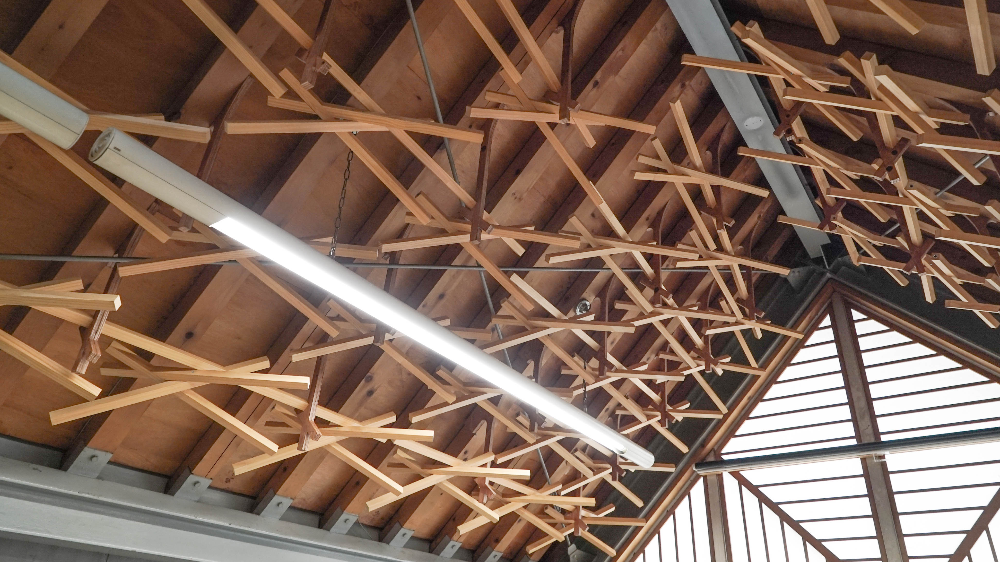
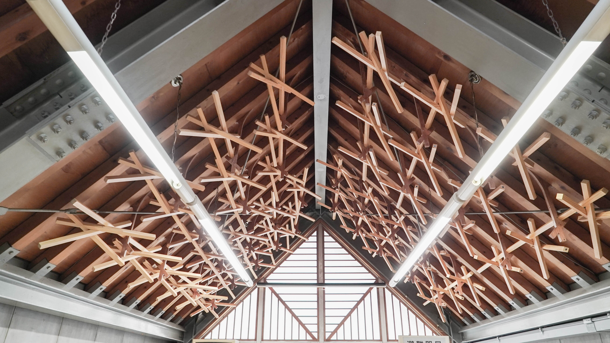

#### 地獄組取り付けプロジェクト

愛知県芸の学生の卒業制作の地獄組。展示終了後、保管されていたものを、天井意匠として再利用する。

既存と既存の間を EMARF で埋め、空間を演出する試み。

天井への取り付けのデザインを grasshopper でスタディし、VR などで確認する。

EMARF を用いて取り付けるための部材を制作。

大工さんの助けを借りながら、天井に設置。

`youtube:https://www.youtube.com/embed/dpVbNamne5E`

 

Date : 2020 年 9 月 19 日  
Category : Interior
